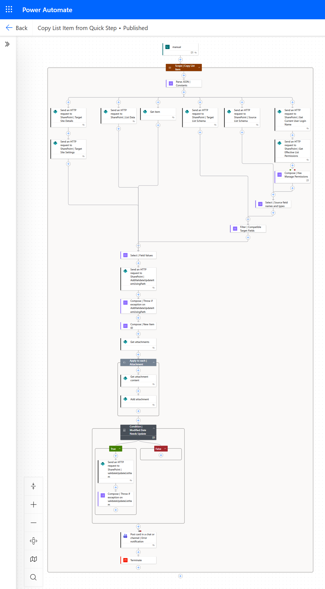

# Copy SharePoint List Item from Quick Step

## Summary

This sample provides a Power Automate flow that will copy a list item from one list in SharePoint Online to another, by matching internal column names and column types automatically.

This makes it extremely quick and easy to set up a Quick Step in a SharePoint list to copy a list item to another list with matching columns, with no need to struggle with difficult column types.

This flow was submitted as part of the [SharePoint Hackathon 2026](https://github.com/SharePoint/sharepoint-hackathon/issues/157).

**Features:**

* Easily set up the flow by simply selecting the target site and list in the trigger settings;
* Copies all columns where a matching column internal name and column type are found;
* Handles all column types that store values in the list (so no ratings column) including:
  * Single and multi-select choice columns;
  * Single and multi-select person columns;
  * Date and DateTime columns, including adjusting UTC to the site's regional date settings;
  * Hyperlink columns, including the display text;
  * Location columns;
  * Image columns;
  * Single and multi-select managed metadata columns;
  * Single and multi-select lookup columns; 
  * System columns (Created and Created By, Modified and Modified By); and
* Copies Attachments



## Applies to


## Compatibility


## Contributors

* [James Williams](https://github.com/wjamesw)

## Version history

Version|Date|Comments
-------|----|--------
1.0|April 12th, 2026|Initial release

## Prerequisites

### Connection References
The solution includes two connection references.
* SharePoint Online
* Microsoft Teams

### SharePoint Online Lists
You will need a source list and target list with matching columns, meaning each column you want to copy must have a matching:
* internal column name; and
* column type.

This is most easily achieved by creating a new target list using the source list as a template. 

## Minimal Path to Awesome

### Import Solution

* [Download](./solution/copy-list-item-from-quick-step.zip) the `.zip` from the `solution` folder
* [Import](https://learn.microsoft.com/en-us/power-apps/maker/data-platform/import-update-export-solutions) the `.zip` file using **Solutions** > **Import Solution**.

### Using the source code

You can also use the [Power Apps CLI](https://docs.microsoft.com/powerapps/developer/data-platform/powerapps-cli) to pack the source code by following these steps:

* Clone the repository to a local drive
* Pack the source files back into a solution `.zip` file:

  ```bash
  pac solution pack --zipfile pathtodestinationfile --folder pathtosourcefolder
  ```

  Making sure to replace `pathtosourcefolder` to point to the path to this sample's `sourcecode` folder, and `pathtodestinationfile` to point to the path of this solution's `.zip` file (located under the `solution` folder)
* Within **Power Apps Studio**, import the solution `.zip` file using **Solutions** > **Import Solution** and select the `.zip` file you just packed.

### Configure the flow and quick step
Once you have imported the solution, edit the flow called "Copy List Item from Quick Step" so that the trigger has the correct Site Address and List Name for your TARGET list. This means the list to which list items will be copied.

Save the flow then go back to the flow details page and select "Edit" next to "Run-only user". Click "SharePoint" then pick the same Site and List as you added to the trigger of the flow (the TARGET list again), then click "Add". Leave both "Connections Used" set to "Provided by run-only user" and click "Save".

Then click "Export" then "Get flow identifier" and click the copy icon to copy the flow identifier to the clipboard.

In your SOURCE list (the one you want to copy items from) [add a Quick Step](https://support.microsoft.com/en-us/office/create-a-quick-step-for-your-list-or-library-b37c2c7f-2ae1-49f9-b4b0-a8d501f5f99e) for selected items of type "Execute a flow" (or add a Quick Step to a Quick Step column) and paste in the flow identifier into "Flow ID". Also add at least a Quick step name.

These configuration steps can be seen in the YouTube video accompanying the SharePoint Hackathon 2026 submission which included this flow: [Click here to view the video.](https://youtu.be/ovTHV4MxAc8?si=hlEiQT_H3ku6QbaV&t=399) 

The above video also shows how the flow can be copied easily for use with another list. The actions are also contained in a single scope for easy copying to another flow.

### Trigger the flow using the quick step
Running the quick step will trigger the flow which will cause the list item to be copied to the target list. If the list item is not copied successfully, then an error notification will be received by the copying user in Microsoft Teams.

## Features

This sample illustrates the following concepts:

* Use of the SharePoint REST api
* Use of [SharePoint REST operations via the Microsoft Graph REST API](https://learn.microsoft.com/en-us/sharepoint/dev/apis/sharepoint-rest-graph) 
* Use of complex and nested expressions
* Reusablility
* Use of XML & XPATH for complex automation  
* Error handling

## Help

We do not support samples, but this community is always willing to help, and we want to improve these samples. We use GitHub to track issues, which makes it easy for  community members to volunteer their time and help resolve issues.

If you encounter any issues while using this sample, you can [create a new issue](https://github.com/pnp/powerapps-samples/issues/new?assignees=&labels=Needs%3A+Triage+%3Amag%3A%2Ctype%3Abug-suspected&template=bug-report.yml&sample=copy-list-item-from-quick-step&authors=@wjamesw&title=copy-list-item-from-quick-step%20-%20).

For questions regarding this sample, [create a new question](https://github.com/pnp/powerapps-samples/issues/new?assignees=&labels=Needs%3A+Triage+%3Amag%3A%2Ctype%3Abug-suspected&template=question.yml&sample=copy-list-item-from-quick-step&authors=@wjamesw&title=copy-list-item-from-quick-step%20-%20).

Finally, if you have an idea for improvement, [make a suggestion](https://github.com/pnp/powerapps-samples/issues/new?assignees=&labels=Needs%3A+Triage+%3Amag%3A%2Ctype%3Abug-suspected&template=suggestion.yml&sample=copy-list-item-from-quick-step&authors=@wjamesw&title=copy-list-item-from-quick-step%20-%20).

## Disclaimer

**THIS CODE IS PROVIDED *AS IS* WITHOUT WARRANTY OF ANY KIND, EITHER EXPRESS OR IMPLIED, INCLUDING ANY IMPLIED WARRANTIES OF FITNESS FOR A PARTICULAR PURPOSE, MERCHANTABILITY, OR NON-INFRINGEMENT.**

