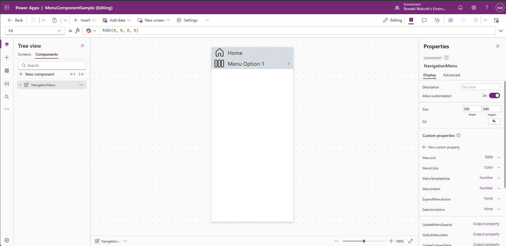
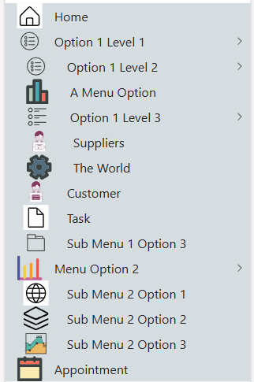
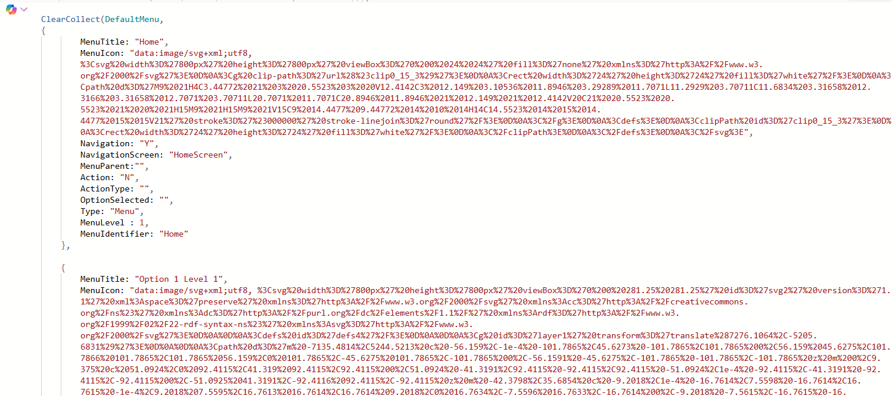
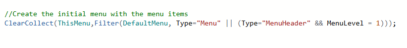
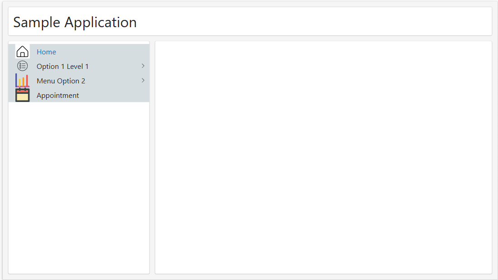
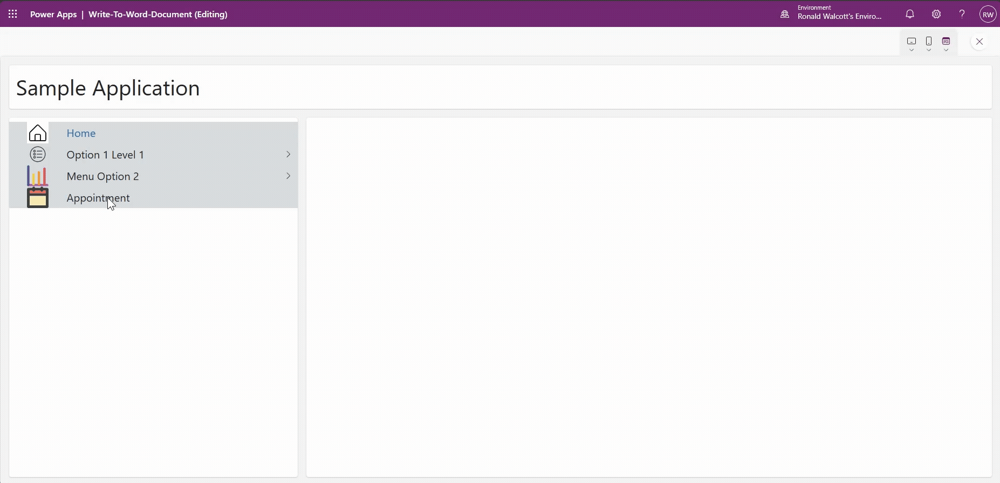

# Multi-level Menu Component

<!--
This is how you want the sample to appear in the samples browser.
When naming your sample, try to give it a friendly name that describes what it does. Avoid using terms like `Power Apps` and `Power Automate` -- because that's what all the samples in this repo is all about.
GOOD 👍:
  Kitten Videos
BAD 👎:
  power-apps-kittenvideos
  Kitten Videos App for Power Platform using Creator Kit
-->

## Summary

This is a Power Apps Canvas component that demonstrates how to implement a multi level menu. It is currently configured for a maximum of 6 levels. 


<!--
Please provide a high-quality screenshot of your solution below. It should be stored in a folder called `assets`. 

If possible, use a resolution of 1920x1080.

If your solution uses a placeholder screen and requires the user to configure it, please use a screenshot of the solution as it appears **after** it has been configured.

You can add as many screen shots as you'd like to help users understand your solution without having to download it and install it.
-->



The menu is built from a table that defines all options in a parent‑child hierarchy (flattened). In this example, the table contains every possible option, but only the relevant items are shown depending on the user’s current position in the menu.




A collection containing all of the items has to be configured. This can be added to the OnStart of the canvas app. MenuParent and MenuLevel must be configured correctly. MenuParent indicates the parent of the menu item and MenuLevel the level of the menu item.



When the app’s OnStart property runs, the menu initially displays items where MenuLevel equals 1. This design was originally based on a single‑level menu, which is why the type check remains in the formula, though it becomes unnecessary if all starting items are correctly assigned to MenuLevel = 1



resulting in 



based on the menu items created in the DefaultMenu collection created above.

When a menu option is chosen the menu title is returned which will allow navigating to a screen based on this value.


## Applies to

<!--
Update the applies to section below.

If your solution includes all the products and features listed below, use the following:


If your solution doesn't include the products and features listed below, use the following:


PRO TIP:
Use the above samples and copy and paste the ones that apply to you.

Don't worry if you're unsure about the compatibility matrix above. We'll verify it when we approve the PR. 
-->


## Compatibility

<!--
Update the compatibility below.

If a premium license is not required and there are no experimental features used in your solution:


If a premium license is required and there are experimental features used in your solution:


Don't worry if you're unsure about the compatibility matrix above. We'll verify it when we approve the PR. 
-->


## Contributors
<!--
We use this section to recognize and promote your contributions. Please provide one author per line -- even if you worked together on it.

We'll only use the info you provided here. Make sure to include your full name, not just your GitHub username.

Provide a link to your GitHub profile to help others find more cool things you have done. The only link we'll accept is a link to your GitHub profile.

If you want to provide links to your social media, blog, and employer name, make sure to update your GitHub profile.
-->

* [Ronald Walcott ](https://github.com/ronaldwalcott)  
*  [Ronald Walcott](https://www.linkedin.com/in/ronald-b-walcott/)

## Version history

Version|Date|Comments
-------|----|--------
1.0|April 06, 2026|Initial release

## Prerequisites

The component relies on two collections to manage the menu. I typically use one called DefaultMenu, which holds the full list of items, and another called ThisMenu, which contains only the current items to be displayed. The gallery that renders the menu is bound to ThisMenu as its data source.

```
ClearCollect(DefaultMenu, 
{
        MenuTitle: "Home",
        MenuIcon: "data:image/svg+xml;utf8, %3Csvg%20width%3D%27800px%27%20height%3D%27800px%27%20viewBox%3D%270%200%2024%2024%27%20fill%3D%27none%27%20xmlns%3D%27http%3A%2F%2Fwww.w3.org%2F2000%2Fsvg%27%3E%0D%0A%3Cg%20clip-path%3D%27url%28%23clip0_15_3%29%27%3E%0D%0A%3Crect%20width%3D%2724%27%20height%3D%2724%27%20fill%3D%27white%27%2F%3E%0D%0A%3Cpath%20d%3D%27M9%2021H4C3.44772%2021%203%2020.5523%203%2020V12.4142C3%2012.149%203.10536%2011.8946%203.29289%2011.7071L11.2929%203.70711C11.6834%203.31658%2012.3166%203.31658%2012.7071%203.70711L20.7071%2011.7071C20.8946%2011.8946%2021%2012.149%2021%2012.4142V20C21%2020.5523%2020.5523%2021%2020%2021H15M9%2021H15M9%2021V15C9%2014.4477%209.44772%2014%2010%2014H14C14.5523%2014%2015%2014.4477%2015%2015V21%27%20stroke%3D%27%23000000%27%20stroke-linejoin%3D%27round%27%2F%3E%0D%0A%3C%2Fg%3E%0D%0A%3Cdefs%3E%0D%0A%3CclipPath%20id%3D%27clip0_15_3%27%3E%0D%0A%3Crect%20width%3D%2724%27%20height%3D%2724%27%20fill%3D%27white%27%2F%3E%0D%0A%3C%2FclipPath%3E%0D%0A%3C%2Fdefs%3E%0D%0A%3C%2Fsvg%3E",
        Navigation: "Y",
        NavigationScreen: "HomeScreen",
        MenuParent:"",
        Action: "N",
        ActionType: "",
        OptionSelected: "",
        Type: "Menu",
        MenuLevel : 1,
        MenuIdentifier: "Home"
    },

    {
        MenuTitle: "Option 1 Level 1",
        MenuIcon: "data:image/svg+xml;utf8, %3Csvg%20width%3D%27800px%27%20height%3D%27800px%27%20viewBox%3D%270%200%20281.25%20281.25%27%20id%3D%27svg2%27%20version%3D%271.1%27%20xml%3Aspace%3D%27preserve%27%20xmlns%3D%27http%3A%2F%2Fwww.w3.org%2F2000%2Fsvg%27%20xmlns%3Acc%3D%27http%3A%2F%2Fcreativecommons.org%2Fns%23%27%20xmlns%3Adc%3D%27http%3A%2F%2Fpurl.org%2Fdc%2Felements%2F1.1%2F%27%20xmlns%3Ardf%3D%27http%3A%2F%2Fwww.w3.org%2F1999%2F02%2F22-rdf-syntax-ns%23%27%20xmlns%3Asvg%3D%27http%3A%2F%2Fwww.w3.org%2F2000%2Fsvg%27%3E%0D%0A%0D%0A%3Cdefs%20id%3D%27defs4%27%2F%3E%0D%0A%0D%0A%3Cg%20id%3D%27layer1%27%20transform%3D%27translate%287276.1064%2C-5205.6831%29%27%3E%0D%0A%0D%0A%3Cpath%20d%3D%27m%20-7135.4814%2C5244.5213%20c%20-56.159%2C-1e-4%20-101.7865%2C45.6273%20-101.7865%2C101.7865%200%2C56.159%2045.6275%2C101.7866%20101.7865%2C101.7865%2056.159%2C0%20101.7865%2C-45.6275%20101.7865%2C-101.7865%200%2C-56.1591%20-45.6275%2C-101.7865%20-101.7865%2C-101.7865%20z%20m%200%2C9.375%20c%2051.0924%2C0%2092.4115%2C41.319%2092.4115%2C92.4115%200%2C51.0924%20-41.3191%2C92.4115%20-92.4115%2C92.4115%20-51.0924%2C1e-4%20-92.4115%2C-41.3191%20-92.4115%2C-92.4115%200%2C-51.0925%2041.3191%2C-92.4116%2092.4115%2C-92.4115%20z%20m%20-42.3798%2C35.6854%20c%20-9.2018%2C1e-4%20-16.7614%2C7.5598%20-16.7614%2C16.7615%20-1e-4%2C9.2018%207.5595%2C16.7613%2016.7614%2C16.7614%209.2018%2C0%2016.7634%2C-7.5596%2016.7633%2C-16.7614%200%2C-9.2018%20-7.5615%2C-16.7615%20-16.7633%2C-16.7615%20z%20m%200%2C9.375%20c%204.1352%2C0%207.3883%2C3.2513%207.3883%2C7.3865%201e-4%2C4.1353%20-3.2531%2C7.3864%20-7.3883%2C7.3864%20-4.1352%2C-10e-5%20-7.3865%2C-3.2511%20-7.3864%2C-7.3864%200%2C-4.1351%203.2512%2C-7.3864%207.3864%2C-7.3865%20z%20m%2032.4353%2C2.699%20a%204.6875%2C4.6875%200%200%200%20-4.6875%2C4.6875%204.6875%2C4.6875%200%200%200%204.6875%2C4.6875%20h%2064.3982%20a%204.6875%2C4.6875%200%200%200%204.6875%2C-4.6875%204.6875%2C4.6875%200%200%200%20-4.6875%2C-4.6875%20z%20m%20-32.4353%2C27.8906%20c%20-9.2019%2C0%20-16.7615%2C7.5597%20-16.7614%2C16.7615%20-1e-4%2C9.2017%207.5595%2C16.7633%2016.7614%2C16.7633%209.2018%2C0%2016.7634%2C-7.5615%2016.7633%2C-16.7633%201e-4%2C-9.2019%20-7.5615%2C-16.7615%20-16.7633%2C-16.7615%20z%20m%200%2C9.375%20c%204.1352%2C0%207.3884%2C3.2512%207.3883%2C7.3865%201e-4%2C4.1352%20-3.2531%2C7.3883%20-7.3883%2C7.3883%20-4.1352%2C0%20-7.3865%2C-3.2531%20-7.3864%2C-7.3883%20-1e-4%2C-4.1352%203.2512%2C-7.3865%207.3864%2C-7.3865%20z%20m%2032.4353%2C2.699%20a%204.6875%2C4.6875%200%200%200%20-4.6875%2C4.6875%204.6875%2C4.6875%200%200%200%204.6875%2C4.6875%20h%2064.3982%20a%204.6875%2C4.6875%200%200%200%204.6875%2C-4.6875%204.6875%2C4.6875%200%200%200%20-4.6875%2C-4.6875%20z%20m%20-32.4353%2C27.8888%20c%20-9.2019%2C0%20-16.7615%2C7.5615%20-16.7614%2C16.7633%20-1e-4%2C9.2017%207.5595%2C16.7613%2016.7614%2C16.7614%209.2018%2C0%2016.7634%2C-7.5596%2016.7633%2C-16.7614%201e-4%2C-9.2019%20-7.5615%2C-16.7633%20-16.7633%2C-16.7633%20z%20m%200%2C9.375%20c%204.1352%2C0%207.3884%2C3.253%207.3883%2C7.3883%201e-4%2C4.1352%20-3.2531%2C7.3864%20-7.3883%2C7.3864%20-4.1352%2C0%20-7.3865%2C-3.2512%20-7.3864%2C-7.3864%20-1e-4%2C-4.1352%203.2512%2C-7.3883%207.3864%2C-7.3883%20z%20m%2032.4353%2C2.7008%20a%204.6875%2C4.6875%200%200%200%20-4.6875%2C4.6875%204.6875%2C4.6875%200%200%200%204.6875%2C4.6875%20h%2064.3982%20a%204.6875%2C4.6875%200%200%200%204.6875%2C-4.6875%204.6875%2C4.6875%200%200%200%20-4.6875%2C-4.6875%20z%27%20id%3D%27circle2353%27%20style%3D%27color%3A%23000000%3Bfill%3A%233d3d3d%3Bfill-opacity%3A1%3Bfill-rule%3Aevenodd%3Bstroke-linecap%3Around%3Bstroke-linejoin%3Around%3B-inkscape-stroke%3Anone%27%2F%3E%0D%0A%0D%0A%3C%2Fg%3E%0D%0A%0D%0A%3C%2Fsvg%3E",
        Navigation: "N",
        NavigationScreen: "EmptyScreen",
        MenuParent:"",
        Action: "N",
        ActionType: "",
        OptionSelected: "",
        Type:"MenuHeader",
        MenuLevel : 1,
        MenuIdentifier: "Option 1"
    },
    {
        MenuTitle: "Option 1 Level 2",
        MenuIcon: "data:image/svg+xml;utf8, %3Csvg%20width%3D%27800px%27%20height%3D%27800px%27%20viewBox%3D%270%200%20281.25%20281.25%27%20id%3D%27svg2%27%20version%3D%271.1%27%20xml%3Aspace%3D%27preserve%27%20xmlns%3D%27http%3A%2F%2Fwww.w3.org%2F2000%2Fsvg%27%20xmlns%3Acc%3D%27http%3A%2F%2Fcreativecommons.org%2Fns%23%27%20xmlns%3Adc%3D%27http%3A%2F%2Fpurl.org%2Fdc%2Felements%2F1.1%2F%27%20xmlns%3Ardf%3D%27http%3A%2F%2Fwww.w3.org%2F1999%2F02%2F22-rdf-syntax-ns%23%27%20xmlns%3Asvg%3D%27http%3A%2F%2Fwww.w3.org%2F2000%2Fsvg%27%3E%0D%0A%0D%0A%3Cdefs%20id%3D%27defs4%27%2F%3E%0D%0A%0D%0A%3Cg%20id%3D%27layer1%27%20transform%3D%27translate%287276.1064%2C-5205.6831%29%27%3E%0D%0A%0D%0A%3Cpath%20d%3D%27m%20-7135.4814%2C5244.5213%20c%20-56.159%2C-1e-4%20-101.7865%2C45.6273%20-101.7865%2C101.7865%200%2C56.159%2045.6275%2C101.7866%20101.7865%2C101.7865%2056.159%2C0%20101.7865%2C-45.6275%20101.7865%2C-101.7865%200%2C-56.1591%20-45.6275%2C-101.7865%20-101.7865%2C-101.7865%20z%20m%200%2C9.375%20c%2051.0924%2C0%2092.4115%2C41.319%2092.4115%2C92.4115%200%2C51.0924%20-41.3191%2C92.4115%20-92.4115%2C92.4115%20-51.0924%2C1e-4%20-92.4115%2C-41.3191%20-92.4115%2C-92.4115%200%2C-51.0925%2041.3191%2C-92.4116%2092.4115%2C-92.4115%20z%20m%20-42.3798%2C35.6854%20c%20-9.2018%2C1e-4%20-16.7614%2C7.5598%20-16.7614%2C16.7615%20-1e-4%2C9.2018%207.5595%2C16.7613%2016.7614%2C16.7614%209.2018%2C0%2016.7634%2C-7.5596%2016.7633%2C-16.7614%200%2C-9.2018%20-7.5615%2C-16.7615%20-16.7633%2C-16.7615%20z%20m%200%2C9.375%20c%204.1352%2C0%207.3883%2C3.2513%207.3883%2C7.3865%201e-4%2C4.1353%20-3.2531%2C7.3864%20-7.3883%2C7.3864%20-4.1352%2C-10e-5%20-7.3865%2C-3.2511%20-7.3864%2C-7.3864%200%2C-4.1351%203.2512%2C-7.3864%207.3864%2C-7.3865%20z%20m%2032.4353%2C2.699%20a%204.6875%2C4.6875%200%200%200%20-4.6875%2C4.6875%204.6875%2C4.6875%200%200%200%204.6875%2C4.6875%20h%2064.3982%20a%204.6875%2C4.6875%200%200%200%204.6875%2C-4.6875%204.6875%2C4.6875%200%200%200%20-4.6875%2C-4.6875%20z%20m%20-32.4353%2C27.8906%20c%20-9.2019%2C0%20-16.7615%2C7.5597%20-16.7614%2C16.7615%20-1e-4%2C9.2017%207.5595%2C16.7633%2016.7614%2C16.7633%209.2018%2C0%2016.7634%2C-7.5615%2016.7633%2C-16.7633%201e-4%2C-9.2019%20-7.5615%2C-16.7615%20-16.7633%2C-16.7615%20z%20m%200%2C9.375%20c%204.1352%2C0%207.3884%2C3.2512%207.3883%2C7.3865%201e-4%2C4.1352%20-3.2531%2C7.3883%20-7.3883%2C7.3883%20-4.1352%2C0%20-7.3865%2C-3.2531%20-7.3864%2C-7.3883%20-1e-4%2C-4.1352%203.2512%2C-7.3865%207.3864%2C-7.3865%20z%20m%2032.4353%2C2.699%20a%204.6875%2C4.6875%200%200%200%20-4.6875%2C4.6875%204.6875%2C4.6875%200%200%200%204.6875%2C4.6875%20h%2064.3982%20a%204.6875%2C4.6875%200%200%200%204.6875%2C-4.6875%204.6875%2C4.6875%200%200%200%20-4.6875%2C-4.6875%20z%20m%20-32.4353%2C27.8888%20c%20-9.2019%2C0%20-16.7615%2C7.5615%20-16.7614%2C16.7633%20-1e-4%2C9.2017%207.5595%2C16.7613%2016.7614%2C16.7614%209.2018%2C0%2016.7634%2C-7.5596%2016.7633%2C-16.7614%201e-4%2C-9.2019%20-7.5615%2C-16.7633%20-16.7633%2C-16.7633%20z%20m%200%2C9.375%20c%204.1352%2C0%207.3884%2C3.253%207.3883%2C7.3883%201e-4%2C4.1352%20-3.2531%2C7.3864%20-7.3883%2C7.3864%20-4.1352%2C0%20-7.3865%2C-3.2512%20-7.3864%2C-7.3864%20-1e-4%2C-4.1352%203.2512%2C-7.3883%207.3864%2C-7.3883%20z%20m%2032.4353%2C2.7008%20a%204.6875%2C4.6875%200%200%200%20-4.6875%2C4.6875%204.6875%2C4.6875%200%200%200%204.6875%2C4.6875%20h%2064.3982%20a%204.6875%2C4.6875%200%200%200%204.6875%2C-4.6875%204.6875%2C4.6875%200%200%200%20-4.6875%2C-4.6875%20z%27%20id%3D%27circle2353%27%20style%3D%27color%3A%23000000%3Bfill%3A%233d3d3d%3Bfill-opacity%3A1%3Bfill-rule%3Aevenodd%3Bstroke-linecap%3Around%3Bstroke-linejoin%3Around%3B-inkscape-stroke%3Anone%27%2F%3E%0D%0A%0D%0A%3C%2Fg%3E%0D%0A%0D%0A%3C%2Fsvg%3E",
        Navigation: "N",
        NavigationScreen: "EmptyScreen",
        MenuParent:"Option 1 Level 1",
        Action: "N",
        ActionType: "",
        OptionSelected: "",
        Type:"MenuHeader",
        MenuLevel : 2,
        MenuIdentifier: "Option 1"
    },
    {
        MenuTitle: "A Menu Option",
        MenuIcon: "data:image/svg+xml;utf8, %3Csvg%20version%3D%271.0%27%20id%3D%27Layer_1%27%20xmlns%3D%27http%3A%2F%2Fwww.w3.org%2F2000%2Fsvg%27%20xmlns%3Axlink%3D%27http%3A%2F%2Fwww.w3.org%2F1999%2Fxlink%27%20%0D%0A%09%20width%3D%27800px%27%20height%3D%27800px%27%20viewBox%3D%270%200%2064%2064%27%20enable-background%3D%27new%200%200%2064%2064%27%20xml%3Aspace%3D%27preserve%27%3E%0D%0A%3Cg%3E%0D%0A%09%3Cpath%20fill%3D%27%23394240%27%20d%3D%27M60%2C32c0-2.211-1.789-4-4-4H44V4c0-2.211-1.789-4-4-4H24c-2.211%2C0-4%2C1.789-4%2C4v12H8c-2.211%2C0-4%2C1.789-4%2C4%0D%0A%09%09v44h56V32z%20M20%2C56h-8V24h8V56z%20M36%2C32v24h-8V20V8h8V32z%20M52%2C56h-8V36h8V56z%27%2F%3E%0D%0A%09%3Crect%20x%3D%2712%27%20y%3D%2724%27%20fill%3D%27%23B4CCB9%27%20width%3D%278%27%20height%3D%2732%27%2F%3E%0D%0A%09%3Crect%20x%3D%2728%27%20y%3D%278%27%20fill%3D%27%2345AAB8%27%20width%3D%278%27%20height%3D%2748%27%2F%3E%0D%0A%09%3Crect%20x%3D%2744%27%20y%3D%2736%27%20fill%3D%27%23F76D57%27%20width%3D%278%27%20height%3D%2720%27%2F%3E%0D%0A%3C%2Fg%3E%0D%0A%3C%2Fsvg%3E",
        Navigation: "Y",
        NavigationScreen: "AMenuOptionScreen",
        MenuParent:"Option 1 Level 2",
        Action: "N",
        ActionType: "",
        OptionSelected: "",
        Type:"MenuItem",
        MenuLevel : 3,
        MenuIdentifier: "Option 1"
    },

    {
        MenuTitle: "Option 1 Level 3",
        MenuIcon: "data:image/svg+xml;utf8, %3Csvg%20width%3D%27800px%27%20height%3D%27800px%27%20viewBox%3D%270%200%20281.25%20281.25%27%20id%3D%27svg2%27%20version%3D%271.1%27%20xml%3Aspace%3D%27preserve%27%20xmlns%3D%27http%3A%2F%2Fwww.w3.org%2F2000%2Fsvg%27%20xmlns%3Acc%3D%27http%3A%2F%2Fcreativecommons.org%2Fns%23%27%20xmlns%3Adc%3D%27http%3A%2F%2Fpurl.org%2Fdc%2Felements%2F1.1%2F%27%20xmlns%3Ardf%3D%27http%3A%2F%2Fwww.w3.org%2F1999%2F02%2F22-rdf-syntax-ns%23%27%20xmlns%3Asvg%3D%27http%3A%2F%2Fwww.w3.org%2F2000%2Fsvg%27%3E%0D%0A%0D%0A%3Cdefs%20id%3D%27defs4%27%2F%3E%0D%0A%0D%0A%3Cg%20id%3D%27layer1%27%20transform%3D%27translate%287276.1064%2C-3697.2496%29%27%3E%0D%0A%0D%0A%3Cg%20id%3D%27g23642%27%20style%3D%27fill%3A%233d3d3d%3Bfill-opacity%3A1%27%3E%0D%0A%0D%0A%3Cpath%20d%3D%27m%20-7211.4766%2C3736.0898%20c%20-14.2755%2C10e-5%20-25.9492%2C11.6738%20-25.9492%2C25.9493%200%2C14.2755%2011.6737%2C25.9491%2025.9492%2C25.9492%2014.2756%2C0%2025.9493%2C-11.6737%2025.9493%2C-25.9492%200%2C-14.2756%20-11.6737%2C-25.9493%20-25.9493%2C-25.9493%20z%20m%200%2C9.375%20c%209.209%2C0%2016.5743%2C7.3653%2016.5743%2C16.5743%200%2C9.2089%20-7.3653%2C16.5742%20-16.5743%2C16.5742%20-9.2088%2C0%20-16.5742%2C-7.3654%20-16.5742%2C-16.5742%200%2C-9.2089%207.3654%2C-16.5742%2016.5742%2C-16.5743%20z%27%20id%3D%27path3266%27%20style%3D%27color%3A%23000000%3Bfill%3A%233d3d3d%3Bfill-opacity%3A1%3Bfill-rule%3Aevenodd%3Bstroke-linecap%3Around%3Bstroke-linejoin%3Around%3B-inkscape-stroke%3Anone%27%2F%3E%0D%0A%0D%0A%3Cpath%20d%3D%27m%20-7167.4922%2C3743.8574%20a%204.6875%2C4.6875%200%200%200%20-4.6875%2C4.6875%204.6875%2C4.6875%200%200%200%204.6875%2C4.6875%20h%20129.2676%20a%204.6875%2C4.6875%200%200%200%204.6875%2C-4.6875%204.6875%2C4.6875%200%200%200%20-4.6875%2C-4.6875%20z%27%20id%3D%27path3268%27%20style%3D%27color%3A%23000000%3Bfill%3A%233d3d3d%3Bfill-opacity%3A1%3Bfill-rule%3Aevenodd%3Bstroke-linecap%3Around%3Bstroke-linejoin%3Around%3B-inkscape-stroke%3Anone%27%2F%3E%0D%0A%0D%0A%3Cpath%20d%3D%27m%20-7167.4922%2C3770.8477%20a%204.6875%2C4.6875%200%200%200%20-4.6875%2C4.6875%204.6875%2C4.6875%200%200%200%204.6875%2C4.6875%20h%2053.5059%20a%204.6875%2C4.6875%200%200%200%204.6875%2C-4.6875%204.6875%2C4.6875%200%200%200%20-4.6875%2C-4.6875%20z%27%20id%3D%27path3270%27%20style%3D%27color%3A%23000000%3Bfill%3A%233d3d3d%3Bfill-opacity%3A1%3Bfill-rule%3Aevenodd%3Bstroke-linecap%3Around%3Bstroke-linejoin%3Around%3B-inkscape-stroke%3Anone%27%2F%3E%0D%0A%0D%0A%3Cpath%20d%3D%27m%20-7211.4766%2C3811.9258%20c%20-14.2755%2C0%20-25.9492%2C11.6737%20-25.9492%2C25.9492%200%2C14.2755%2011.6737%2C25.9472%2025.9492%2C25.9473%2014.2756%2C0%2025.9493%2C-11.6718%2025.9493%2C-25.9473%200%2C-14.2755%20-11.6737%2C-25.9492%20-25.9493%2C-25.9492%20z%20m%200%2C9.375%20c%209.209%2C0%2016.5743%2C7.3653%2016.5743%2C16.5742%200%2C9.2089%20-7.3653%2C16.5723%20-16.5743%2C16.5723%20-9.2088%2C-10e-5%20-16.5742%2C-7.3634%20-16.5742%2C-16.5723%200%2C-9.2089%207.3654%2C-16.5742%2016.5742%2C-16.5742%20z%27%20id%3D%27circle3282%27%20style%3D%27color%3A%23000000%3Bfill%3A%233d3d3d%3Bfill-opacity%3A1%3Bfill-rule%3Aevenodd%3Bstroke-linecap%3Around%3Bstroke-linejoin%3Around%3B-inkscape-stroke%3Anone%27%2F%3E%0D%0A%0D%0A%3Cpath%20d%3D%27m%20-7167.4922%2C3819.6914%20a%204.6875%2C4.6875%200%200%200%20-4.6875%2C4.6875%204.6875%2C4.6875%200%200%200%204.6875%2C4.6875%20h%20129.2676%20a%204.6875%2C4.6875%200%200%200%204.6875%2C-4.6875%204.6875%2C4.6875%200%200%200%20-4.6875%2C-4.6875%20z%27%20id%3D%27path3284%27%20style%3D%27color%3A%23000000%3Bfill%3A%233d3d3d%3Bfill-opacity%3A1%3Bfill-rule%3Aevenodd%3Bstroke-linecap%3Around%3Bstroke-linejoin%3Around%3B-inkscape-stroke%3Anone%27%2F%3E%0D%0A%0D%0A%3Cpath%20d%3D%27m%20-7167.4922%2C3846.6816%20a%204.6875%2C4.6875%200%200%200%20-4.6875%2C4.6875%204.6875%2C4.6875%200%200%200%204.6875%2C4.6875%20h%2053.5059%20a%204.6875%2C4.6875%200%200%200%204.6875%2C-4.6875%204.6875%2C4.6875%200%200%200%20-4.6875%2C-4.6875%20z%27%20id%3D%27path3286%27%20style%3D%27color%3A%23000000%3Bfill%3A%233d3d3d%3Bfill-opacity%3A1%3Bfill-rule%3Aevenodd%3Bstroke-linecap%3Around%3Bstroke-linejoin%3Around%3B-inkscape-stroke%3Anone%27%2F%3E%0D%0A%0D%0A%3Cpath%20d%3D%27m%20-7211.4766%2C3887.7617%20c%20-14.2754%2C1e-4%20-25.9491%2C11.6718%20-25.9492%2C25.9473%200%2C14.2755%2011.6737%2C25.9492%2025.9492%2C25.9492%2014.2756%2C0%2025.9493%2C-11.6737%2025.9493%2C-25.9492%20-1e-4%2C-14.2755%20-11.6738%2C-25.9473%20-25.9493%2C-25.9473%20z%20m%200%2C9.375%20c%209.2089%2C0%2016.5742%2C7.3634%2016.5743%2C16.5723%200%2C9.2089%20-7.3653%2C16.5742%20-16.5743%2C16.5742%20-9.2088%2C0%20-16.5742%2C-7.3653%20-16.5742%2C-16.5742%200%2C-9.2089%207.3654%2C-16.5723%2016.5742%2C-16.5723%20z%27%20id%3D%27circle3292%27%20style%3D%27color%3A%23000000%3Bfill%3A%233d3d3d%3Bfill-opacity%3A1%3Bfill-rule%3Aevenodd%3Bstroke-linecap%3Around%3Bstroke-linejoin%3Around%3B-inkscape-stroke%3Anone%27%2F%3E%0D%0A%0D%0A%3Cpath%20d%3D%27m%20-7167.4922%2C3895.5273%20a%204.6875%2C4.6875%200%200%200%20-4.6875%2C4.6875%204.6875%2C4.6875%200%200%200%204.6875%2C4.6875%20h%20129.2676%20a%204.6875%2C4.6875%200%200%200%204.6875%2C-4.6875%204.6875%2C4.6875%200%200%200%20-4.6875%2C-4.6875%20z%27%20id%3D%27path3294%27%20style%3D%27color%3A%23000000%3Bfill%3A%233d3d3d%3Bfill-opacity%3A1%3Bfill-rule%3Aevenodd%3Bstroke-linecap%3Around%3Bstroke-linejoin%3Around%3B-inkscape-stroke%3Anone%27%2F%3E%0D%0A%0D%0A%3Cpath%20d%3D%27m%20-7167.4922%2C3922.5176%20a%204.6875%2C4.6875%200%200%200%20-4.6875%2C4.6875%204.6875%2C4.6875%200%200%200%204.6875%2C4.6875%20h%2053.5059%20a%204.6875%2C4.6875%200%200%200%204.6875%2C-4.6875%204.6875%2C4.6875%200%200%200%20-4.6875%2C-4.6875%20z%27%20id%3D%27path3296%27%20style%3D%27color%3A%23000000%3Bfill%3A%233d3d3d%3Bfill-opacity%3A1%3Bfill-rule%3Aevenodd%3Bstroke-linecap%3Around%3Bstroke-linejoin%3Around%3B-inkscape-stroke%3Anone%27%2F%3E%0D%0A%0D%0A%3C%2Fg%3E%0D%0A%0D%0A%3C%2Fg%3E%0D%0A%0D%0A%3C%2Fsvg%3E",
        Navigation: "N",
        NavigationScreen: "EmptyScreen",
        MenuParent:"Option 1 Level 2",
        Action: "N",
        ActionType: "",
        OptionSelected: "",
        Type:"MenuHeader",
        MenuLevel : 3,
        MenuIdentifier: "Option 1"
    },
    {
        MenuTitle: "Suppliers",
        MenuIcon: "data:image/svg+xml;utf8, %3Csvg%20width%3D%27800px%27%20height%3D%27800px%27%20viewBox%3D%270%200%201024%201024%27%20class%3D%27icon%27%20%20version%3D%271.1%27%20xmlns%3D%27http%3A%2F%2Fwww.w3.org%2F2000%2Fsvg%27%3E%3Cpath%20d%3D%27M683.8%20238.1c0%2012.3-1.3%2024.4-3.8%2036-4.3%2020-12.2%2038.8-22.8%2055.5-30.2%2047.3-83.2%2078.6-143.4%2078.6-59.7%200-112.2-30.8-142.5-77.3-11.4-17.4-19.6-37.1-24-58.1-2.3-11.2-3.5-22.8-3.5-34.6%200-93.9%2076.1-170.1%20170.1-170.1%209.5%200%2018.9%200.8%2028%202.3%207.1%201.2%2014.1%202.8%2020.8%204.8%2069.9%2020.9%20121.1%2086%20121.1%20162.9z%27%20fill%3D%27%23843A5F%27%20%2F%3E%3Cpath%20d%3D%27M513.7%20411.2c-58.7%200-113-29.4-145.1-78.7-11.8-18.1-20-38-24.4-59.2-2.4-11.5-3.6-23.4-3.6-35.2%200-95.4%2077.6-173.1%20173.1-173.1%209.6%200%2019.1%200.8%2028.5%202.3%207.1%201.2%2014.3%202.8%2021.2%204.9%2034.9%2010.5%2066.4%2032.3%2088.5%2061.6%2022.9%2030.2%2034.9%2066.3%2034.9%20104.3%200%2012.4-1.3%2024.7-3.9%2036.6-4.3%2020.1-12.1%2039.1-23.3%2056.5-32%2050.1-86.5%2080-145.9%2080z%20m0-340.1c-92.1%200-167.1%2075-167.1%20167.1%200%2011.5%201.2%2022.9%203.5%2034%204.2%2020.4%2012.2%2039.6%2023.6%2057.1%2031%2047.6%2083.3%2075.9%20140%2075.9%2057.3%200%20110-28.9%20140.9-77.2%2010.7-16.8%2018.3-35.1%2022.4-54.5%202.5-11.5%203.7-23.4%203.7-35.3%200-73.3-49-139.1-119.1-160.1-6.7-2-13.6-3.6-20.5-4.7-8.9-1.6-18.2-2.3-27.4-2.3z%27%20fill%3D%27%23843A5F%27%20%2F%3E%3Cpath%20d%3D%27M512.7%20652.5m-214%200a214%20214%200%201%200%20428%200%20214%20214%200%201%200-428%200Z%27%20fill%3D%27%23AE9AA4%27%20%2F%3E%3Cpath%20d%3D%27M512.7%20869.5c-58%200-112.5-22.6-153.5-63.6s-63.6-95.5-63.6-153.5%2022.6-112.5%2063.6-153.5%2095.5-63.6%20153.5-63.6S625.2%20458%20666.2%20499s63.6%2095.5%2063.6%20153.5S707.2%20765%20666.2%20806s-95.5%2063.5-153.5%2063.5z%20m0-428.1c-116.4%200-211%2094.7-211%20211s94.7%20211%20211%20211%20211-94.7%20211-211-94.6-211-211-211z%27%20fill%3D%27%23843A5F%27%20%2F%3E%3Cpath%20d%3D%27M512.7%20573.7l-70.4-122h140.9z%27%20fill%3D%27%23FFFFFF%27%20%2F%3E%3Cpath%20d%3D%27M512.7%20579.7l-75.6-131h151.3l-75.7%20131z%20m-65.2-125l65.2%20113%2065.2-113H447.5z%27%20fill%3D%27%23843A5F%27%20%2F%3E%3Cpath%20d%3D%27M371.1%20178.9v193.7c0%2043.5%2035.6%2079.1%2079.1%2079.1H578c43.5%200%2079.1-35.6%2079.1-79.1V178.9%27%20fill%3D%27%23E6D8DF%27%20%2F%3E%3Cpath%20d%3D%27M578%20454.7H450.3c-45.3%200-82.1-36.8-82.1-82.1V178.9h6v193.7c0%2042%2034.1%2076.1%2076.1%2076.1H578c42%200%2076.1-34.1%2076.1-76.1V178.9h6v193.7c0%2045.3-36.8%2082.1-82.1%2082.1z%27%20fill%3D%27%23843A5F%27%20%2F%3E%3Cpath%20d%3D%27M433.5%20261.1m-67.9%200a67.9%2067.9%200%201%200%20135.8%200%2067.9%2067.9%200%201%200-135.8%200Z%27%20fill%3D%27%23FFFFFF%27%20%2F%3E%3Cpath%20d%3D%27M433.5%20332c-39.1%200-70.9-31.8-70.9-70.9%200-39.1%2031.8-70.9%2070.9-70.9%2039.1%200%2070.9%2031.8%2070.9%2070.9%200%2039.1-31.8%2070.9-70.9%2070.9z%20m0-135.9c-35.8%200-64.9%2029.1-64.9%2064.9s29.1%2064.9%2064.9%2064.9%2064.9-29.1%2064.9-64.9-29.1-64.9-64.9-64.9z%27%20fill%3D%27%23843A5F%27%20%2F%3E%3Cpath%20d%3D%27M594.1%20261.1m-67.9%200a67.9%2067.9%200%201%200%20135.8%200%2067.9%2067.9%200%201%200-135.8%200Z%27%20fill%3D%27%23FFFFFF%27%20%2F%3E%3Cpath%20d%3D%27M594.1%20332c-39.1%200-70.9-31.8-70.9-70.9%200-39.1%2031.8-70.9%2070.9-70.9%2039.1%200%2070.9%2031.8%2070.9%2070.9%200.1%2039.1-31.7%2070.9-70.9%2070.9z%20m0-135.9c-35.8%200-64.9%2029.1-64.9%2064.9s29.1%2064.9%2064.9%2064.9S659%20296.8%20659%20261s-29.1-64.9-64.9-64.9z%27%20fill%3D%27%23843A5F%27%20%2F%3E%3Cpath%20d%3D%27M533.6%20275.8h-6c0-7.4-6-13.4-13.4-13.4s-13.4%206-13.4%2013.4h-6c0-10.7%208.7-19.4%2019.4-19.4%2010.6%200%2019.4%208.7%2019.4%2019.4zM513.9%20407.8c-23.1%200-46.5-5.6-46.5-16.3h6c0%203.5%2014.3%2010.3%2040.5%2010.3s40.5-6.8%2040.5-10.3h6c0%2010.7-23.4%2016.3-46.5%2016.3z%27%20fill%3D%27%23843A5F%27%20%2F%3E%3Cpath%20d%3D%27M750.6%20916.1H276.2c-6.6%200-12-5.4-12-12V528.5c0-6.6%205.4-12%2012-12h474.5c6.6%200%2012%205.4%2012%2012v375.6c-0.1%206.6-5.5%2012-12.1%2012z%27%20fill%3D%27%23FFFFFF%27%20%2F%3E%3Cpath%20d%3D%27M750.6%20919.1H276.2c-8.3%200-15-6.7-15-15V528.5c0-8.3%206.7-15%2015-15h474.5c8.3%200%2015%206.7%2015%2015v375.6c-0.1%208.3-6.8%2015-15.1%2015zM276.2%20519.5c-5%200-9%204-9%209v375.6c0%205%204%209%209%209h474.5c5%200%209-4%209-9V528.5c0-5-4-9-9-9H276.2z%27%20fill%3D%27%23843A5F%27%20%2F%3E%3Cpath%20d%3D%27M651.8%20133.8C630%20105%20599.3%2083.4%20565%2072.8l-1.7-0.5c-7-2.1-14.1-3.7-21.2-4.9h-0.1l-2.8-0.5c-8.4-1.3-17-1.9-25.6-1.9-95.4%200-173.1%2077.6-173.1%20173.1%200%2011.9%201.2%2023.7%203.6%2035.2l0.4%201.8%201.7%200.5c6.8%202%2013.8%203.7%2020.8%204.8l3.6%200.6c8.3%201.2%2016.8%201.8%2025.2%201.8%2038.5%200%2074.9-12.4%20105.3-35.7%2022-16.9%2039.8-39%2051.5-64.1%203.1%206.2%206.5%2012.2%2010.3%2018%2022%2033.5%2055.1%2058.6%2093.1%2070.5%201.5%200.5%202.9%200.9%204.4%201.3%206.1%201.7%2012.5%203.2%2018.8%204.2l2.8%200.5%200.6-2.8c2.6-11.9%203.9-24.2%203.9-36.6%200.3-38-11.8-74-34.7-104.3z%27%20fill%3D%27%23843A5F%27%20%2F%3E%3Cpath%20d%3D%27M786.2%20745.6c-12.9%2018-33.9%2018-46.8%200s-12.9-47.1%200-65c12.9-18%2033.9-18%2046.8%200%2012.9%2017.9%2012.9%2047%200%2065z%27%20fill%3D%27%23E6D8DF%27%20%2F%3E%3Cpath%20d%3D%27M762.8%20762c-9.8%200-19-5.2-25.8-14.7-13.6-18.9-13.6-49.7%200-68.6%206.8-9.5%2016-14.7%2025.8-14.7s19%205.2%2025.8%2014.7c13.6%2018.9%2013.6%2049.7%200%2068.6-6.8%209.5-16%2014.7-25.8%2014.7z%20m0-91.9c-7.8%200-15.3%204.3-21%2012.2-12.2%2017-12.2%2044.6%200%2061.5%205.7%207.9%2013.1%2012.2%2021%2012.2%207.8%200%2015.3-4.3%2021-12.2%2012.2-17%2012.2-44.6%200-61.5-5.7-7.9-13.2-12.2-21-12.2z%27%20fill%3D%27%23843A5F%27%20%2F%3E%3Cpath%20d%3D%27M288%20745.6c-12.9%2018-33.9%2018-46.8%200s-12.9-47.1%200-65c12.9-18%2033.9-18%2046.8%200%2012.9%2017.9%2012.9%2047%200%2065z%27%20fill%3D%27%23E6D8DF%27%20%2F%3E%3Cpath%20d%3D%27M264.6%20762c-9.8%200-19-5.2-25.8-14.7-13.6-18.9-13.6-49.7%200-68.6%206.8-9.5%2016-14.7%2025.8-14.7s19%205.2%2025.8%2014.7c13.6%2018.9%2013.6%2049.7%200%2068.6-6.8%209.5-16%2014.7-25.8%2014.7z%20m0-91.9c-7.8%200-15.3%204.3-21%2012.2-12.2%2017-12.2%2044.6%200%2061.5%205.7%207.9%2013.1%2012.2%2021%2012.2%207.8%200%2015.3-4.3%2021-12.2%2012.2-17%2012.2-44.6%200-61.5-5.7-7.9-13.1-12.2-21-12.2z%27%20fill%3D%27%23843A5F%27%20%2F%3E%3Cpath%20d%3D%27M432.8%20710.6h11.8l24.1%2038.4%2024.1-38.4h11.8l-24%2037.4h16.3v9.4h-22.2v9.4h22.2v9.4h-22.2v18.7h-11.3v-18.7h-22.2v-9.4h22.2v-9.4h-22.2V748H457l-24.2-37.4z%27%20fill%3D%27%23843A5F%27%20%2F%3E%3Cpath%20d%3D%27M671.1%20818.6H372.6c-8.8%200-16-7.2-16-16V616.3c0-8.8%207.2-16%2016-16h298.5c8.8%200%2016%207.2%2016%2016v186.3c0%208.8-7.2%2016-16%2016zM372.6%20608.3c-4.4%200-8%203.6-8%208v186.3c0%204.4%203.6%208%208%208h298.5c4.4%200%208-3.6%208-8V616.3c0-4.4-3.6-8-8-8H372.6z%27%20fill%3D%27%23843A5F%27%20%2F%3E%3Cpath%20d%3D%27M435.2%20665.6l9-42.9h14.7c3.2%200%205.4%200.1%206.7%200.3%202.1%200.3%203.9%200.9%205.4%201.8s2.6%202.1%203.3%203.5%201.1%203.1%201.1%204.9c0%202.4-0.7%204.4-2%206.2s-3.4%203.1-6.2%204c2.2%200.6%203.9%201.7%205.2%203.2s1.9%203.3%201.9%205.3c0%202.6-0.7%205-2.2%207.3s-3.5%204-6.1%205-6.1%201.5-10.6%201.5h-20.2z%20m10.3-7h8.5c3.6%200%206-0.2%207.2-0.7s2.2-1.2%202.9-2.3%201.1-2.2%201.1-3.3c0-1.4-0.5-2.6-1.6-3.5s-2.8-1.4-5.3-1.4h-10.5l-2.3%2011.2z%20m3.9-18.7h6.7c3%200%205.2-0.2%206.5-0.6s2.3-1.1%203-2.1%201-2%201-3.1-0.3-2-0.9-2.7-1.5-1.2-2.7-1.4c-0.6-0.1-2.2-0.2-4.7-0.2h-6.9l-2%2010.1zM506.8%20656.1h-17l-5.2%209.5h-9.1l24.3-42.9h9.8l7%2042.9h-8.4l-1.4-9.5z%20m-1.1-7.2l-2.5-17.3-10.4%2017.3h12.9zM556.3%20665.6h-8.2l-11.6-28.9-6%2028.9h-8.2l9-42.9h8.3l11.6%2028.7%206-28.7h8.2l-9.1%2042.9zM565.2%20665.6l9-42.9h8.8l-3.8%2018.3%2019.9-18.3h11.8l-19.3%2016.8%2014.2%2026.1h-10l-10.6-20.4-8.3%207.3-2.8%2013.2h-8.9z%27%20fill%3D%27%2380385C%27%20%2F%3E%3Cpath%20d%3D%27M606.8%20793.1h-79.3v-80.8h79.3v80.8z%20m-76.3-3h73.3v-74.8h-73.3v74.8z%27%20fill%3D%27%23843A5F%27%20%2F%3E%3C%2Fsvg%3E",
        Navigation: "Y",
        NavigationScreen: "SupplierScreen",
        MenuParent:"Option 1 Level 3",
        Action: "N",
        ActionType: "",
        OptionSelected: "",
        Type:"MenuItem",
        MenuLevel : 4,
        MenuIdentifier: "Option 1"
    },
    {
        MenuTitle: "The World",
        MenuIcon: "data:image/svg+xml;utf8, %3Csvg%20version%3D%271.0%27%20id%3D%27Layer_1%27%20xmlns%3D%27http%3A%2F%2Fwww.w3.org%2F2000%2Fsvg%27%20xmlns%3Axlink%3D%27http%3A%2F%2Fwww.w3.org%2F1999%2Fxlink%27%20%0D%0A%09%20width%3D%27800px%27%20height%3D%27800px%27%20viewBox%3D%270%200%2064%2064%27%20enable-background%3D%27new%200%200%2064%2064%27%20xml%3Aspace%3D%27preserve%27%3E%0D%0A%3Cg%3E%0D%0A%09%3Cg%3E%0D%0A%09%09%3Cpath%20fill%3D%27%23394240%27%20d%3D%27M60.002%2C20.026h-7.331l3.517-6.096c1.099-1.899%2C0.446-4.322-1.449-5.417L40.997%2C0.58%0D%0A%09%09%09c-1.896-1.094-4.318-0.445-5.416%2C1.454l-3.576%2C6.19l-3.576-6.19c-1.098-1.899-3.521-2.548-5.42-1.454L9.272%2C8.514%0D%0A%09%09%09c-1.899%2C1.094-2.548%2C3.517-1.45%2C5.417l3.518%2C6.096H4.008c-2.208%2C0-3.998%2C1.79-3.998%2C4.002v16c0%2C2.204%2C1.79%2C3.994%2C3.998%2C3.994%0D%0A%09%09%09h7.332l-3.518%2C6.096c-1.098%2C1.899-0.449%2C4.322%2C1.45%2C5.417l13.737%2C7.934c1.899%2C1.094%2C4.322%2C0.445%2C5.42-1.454l3.576-6.19l3.576%2C6.19%0D%0A%09%09%09c1.098%2C1.899%2C3.521%2C2.548%2C5.42%2C1.454l13.737-7.934c1.896-1.095%2C2.548-3.518%2C1.449-5.417l-3.517-6.096h7.331%0D%0A%09%09%09c2.208%2C0%2C3.998-1.79%2C3.998-3.994v-16C64%2C21.816%2C62.21%2C20.026%2C60.002%2C20.026z%20M56%2C36.026h-6.464%0D%0A%09%09%09c-0.82%2C3.596-2.72%2C6.769-5.338%2C9.191l3.138%2C5.433l-6.866%2C3.963l-3.13-5.417c-1.688%2C0.523-3.479%2C0.805-5.335%2C0.805%0D%0A%09%09%09c-1.86%2C0-3.65-0.281-5.339-0.805l-3.126%2C5.417l-6.87-3.963l3.138-5.433c-2.614-2.423-4.514-5.596-5.334-9.191H8.01v-8.004h6.456%0D%0A%09%09%09c0.812-3.604%2C2.708-6.792%2C5.33-9.215l-3.126-5.409l6.87-3.962l3.11%2C5.385c1.692-0.532%2C3.49-0.813%2C5.354-0.813%0D%0A%09%09%09s3.662%2C0.281%2C5.354%2C0.805l3.11-5.377l6.866%2C3.962l-3.122%2C5.409c2.618%2C2.423%2C4.518%2C5.611%2C5.33%2C9.215H56V36.026z%27%2F%3E%0D%0A%09%09%3Cpath%20fill%3D%27%23394240%27%20d%3D%27M32.024%2C23.981c-4.424%2C0-8.004%2C3.58-8.004%2C8.004s3.58%2C8.004%2C8.004%2C8.004s8.004-3.58%2C8.004-8.004%0D%0A%09%09%09S36.448%2C23.981%2C32.024%2C23.981z%27%2F%3E%0D%0A%09%3C%2Fg%3E%0D%0A%09%3Cpath%20fill%3D%27%23506C7F%27%20d%3D%27M49.544%2C28.022c-0.812-3.604-2.712-6.792-5.33-9.215l3.122-5.409L40.47%2C9.436l-3.11%2C5.377%0D%0A%09%09c-1.692-0.524-3.49-0.805-5.354-0.805s-3.662%2C0.281-5.354%2C0.813l-3.11-5.385l-6.87%2C3.962l3.126%2C5.409%0D%0A%09%09c-2.622%2C2.423-4.518%2C5.611-5.33%2C9.215H8.01v8.004h6.464c0.82%2C3.596%2C2.72%2C6.769%2C5.334%2C9.191L16.67%2C50.65l6.87%2C3.963l3.126-5.417%0D%0A%09%09c1.688%2C0.523%2C3.479%2C0.805%2C5.339%2C0.805c1.856%2C0%2C3.646-0.281%2C5.335-0.805l3.13%2C5.417l6.866-3.963l-3.138-5.433%0D%0A%09%09c2.618-2.423%2C4.518-5.596%2C5.338-9.191H56v-8.004H49.544z%20M31.985%2C40.067c-4.42%2C0-8.004-3.584-8.004-8.004s3.584-8.004%2C8.004-8.004%0D%0A%09%09s8.004%2C3.584%2C8.004%2C8.004S36.405%2C40.067%2C31.985%2C40.067z%27%2F%3E%0D%0A%3C%2Fg%3E%0D%0A%3C%2Fsvg%3E",
        Navigation: "Y",
        NavigationScreen: "TheWorldScreen",
        MenuParent:"Option 1 Level 3",
        Action: "N",
        ActionType: "",
        OptionSelected: "",
        Type:"MenuItem",
        MenuLevel : 4,
        MenuIdentifier: "Option 1"
    },

    {
        MenuTitle: "Customer",
        MenuIcon: "data:image/svg+xml;utf8, %3Csvg%20width%3D%27800px%27%20height%3D%27800px%27%20viewBox%3D%270%200%201024%201024%27%20class%3D%27icon%27%20%20version%3D%271.1%27%20xmlns%3D%27http%3A%2F%2Fwww.w3.org%2F2000%2Fsvg%27%3E%3Cpath%20d%3D%27M682.4%20238.5c0%2012.3-1.3%2024.4-3.8%2036-4.3%2020-12.2%2038.8-22.8%2055.5-30.2%2047.3-83.2%2078.6-143.4%2078.6-59.7%200-112.2-30.8-142.6-77.3-11.4-17.4-19.6-37.1-24-58.1-2.3-11.2-3.5-22.8-3.5-34.6%200-93.9%2076.1-170.1%20170.1-170.1%209.5%200%2018.9%200.8%2028%202.3%207.1%201.2%2014.1%202.8%2020.8%204.8%2070.1%2020.9%20121.2%2085.9%20121.2%20162.9z%27%20fill%3D%27%23843A5F%27%20%2F%3E%3Cpath%20d%3D%27M512.4%20411.6c-58.7%200-113-29.4-145.1-78.7-11.8-18.1-20-38-24.4-59.2-2.4-11.5-3.6-23.4-3.6-35.2%200-95.4%2077.6-173.1%20173.1-173.1%209.6%200%2019.1%200.8%2028.5%202.3%207.1%201.2%2014.3%202.8%2021.2%204.9%2034.9%2010.5%2066.4%2032.3%2088.5%2061.6%2022.9%2030.2%2034.9%2066.3%2034.9%20104.3%200%2012.4-1.3%2024.7-3.9%2036.6-4.3%2020.1-12.1%2039.1-23.3%2056.5-32%2050.1-86.6%2080-145.9%2080z%20m0-340.2c-92.1%200-167.1%2075-167.1%20167.1%200%2011.5%201.2%2022.9%203.5%2034%204.2%2020.4%2012.2%2039.6%2023.6%2057.1%2031%2047.6%2083.3%2075.9%20140%2075.9%2057.3%200%20110-28.9%20140.9-77.2%2010.7-16.8%2018.3-35.1%2022.4-54.5%202.5-11.5%203.7-23.4%203.7-35.3%200-73.3-49-139.1-119.1-160.1-6.7-2-13.6-3.6-20.5-4.7-9-1.5-18.2-2.3-27.4-2.3z%27%20fill%3D%27%23843A5F%27%20%2F%3E%3Cpath%20d%3D%27M511.4%20652.9m-214%200a214%20214%200%201%200%20428%200%20214%20214%200%201%200-428%200Z%27%20fill%3D%27%23AE9AA4%27%20%2F%3E%3Cpath%20d%3D%27M511.4%20869.9c-58%200-112.5-22.6-153.5-63.6s-63.6-95.5-63.6-153.5%2022.6-112.5%2063.6-153.5%2095.5-63.6%20153.5-63.6%20112.5%2022.6%20153.5%2063.6%2063.6%2095.5%2063.6%20153.5-22.6%20112.5-63.6%20153.5-95.5%2063.6-153.5%2063.6z%20m0-428.1c-116.4%200-211%2094.7-211%20211s94.7%20211%20211%20211%20211-94.7%20211-211-94.6-211-211-211z%27%20fill%3D%27%23843A5F%27%20%2F%3E%3Cpath%20d%3D%27M511.4%20574.1l-70.4-122h140.8z%27%20fill%3D%27%23FFFFFF%27%20%2F%3E%3Cpath%20d%3D%27M511.4%20580.1l-75.6-131H587l-75.6%20131z%20m-65.2-125l65.2%20113%2065.2-113H446.2z%27%20fill%3D%27%23843A5F%27%20%2F%3E%3Cpath%20d%3D%27M369.8%20179.3V373c0%2043.5%2035.6%2079.1%2079.1%2079.1h127.8c43.5%200%2079.1-35.6%2079.1-79.1V179.3%27%20fill%3D%27%23E6D8DF%27%20%2F%3E%3Cpath%20d%3D%27M576.7%20455.1H448.9c-45.3%200-82.1-36.8-82.1-82.1V179.3h6V373c0%2042%2034.1%2076.1%2076.1%2076.1h127.8c42%200%2076.1-34.1%2076.1-76.1V179.3h6V373c0%2045.3-36.9%2082.1-82.1%2082.1z%27%20fill%3D%27%23843A5F%27%20%2F%3E%3Cpath%20d%3D%27M432.2%20261.4m-67.9%200a67.9%2067.9%200%201%200%20135.8%200%2067.9%2067.9%200%201%200-135.8%200Z%27%20fill%3D%27%23FFFFFF%27%20%2F%3E%3Cpath%20d%3D%27M432.2%20332.4c-39.1%200-70.9-31.8-70.9-70.9%200-39.1%2031.8-70.9%2070.9-70.9%2039.1%200%2070.9%2031.8%2070.9%2070.9%200%2039-31.8%2070.9-70.9%2070.9z%20m0-135.9c-35.8%200-64.9%2029.1-64.9%2064.9s29.1%2064.9%2064.9%2064.9%2064.9-29.1%2064.9-64.9-29.1-64.9-64.9-64.9z%27%20fill%3D%27%23843A5F%27%20%2F%3E%3Cpath%20d%3D%27M592.8%20261.4m-67.9%200a67.9%2067.9%200%201%200%20135.8%200%2067.9%2067.9%200%201%200-135.8%200Z%27%20fill%3D%27%23FFFFFF%27%20%2F%3E%3Cpath%20d%3D%27M592.8%20332.4c-39.1%200-70.9-31.8-70.9-70.9%200-39.1%2031.8-70.9%2070.9-70.9%2039.1%200%2070.9%2031.8%2070.9%2070.9%200%2039-31.8%2070.9-70.9%2070.9z%20m0-135.9c-35.8%200-64.9%2029.1-64.9%2064.9s29.1%2064.9%2064.9%2064.9%2064.9-29.1%2064.9-64.9-29.1-64.9-64.9-64.9z%27%20fill%3D%27%23843A5F%27%20%2F%3E%3Cpath%20d%3D%27M532.2%20276.2h-6c0-7.4-6-13.4-13.4-13.4s-13.4%206-13.4%2013.4h-6c0-10.7%208.7-19.4%2019.4-19.4%2010.7-0.1%2019.4%208.6%2019.4%2019.4zM512.6%20408.1c-23.1%200-46.5-5.6-46.5-16.3h6c0%203.5%2014.3%2010.3%2040.5%2010.3s40.5-6.8%2040.5-10.3h6c-0.1%2010.7-23.4%2016.3-46.5%2016.3z%27%20fill%3D%27%23843A5F%27%20%2F%3E%3Cpath%20d%3D%27M749.3%20916.5H274.8c-6.6%200-12-5.4-12-12V528.9c0-6.6%205.4-12%2012-12h474.5c6.6%200%2012%205.4%2012%2012v375.6c0%206.6-5.4%2012-12%2012z%27%20fill%3D%27%23FFFFFF%27%20%2F%3E%3Cpath%20d%3D%27M749.3%20919.5H274.8c-8.3%200-15-6.7-15-15V528.9c0-8.3%206.7-15%2015-15h474.5c8.3%200%2015%206.7%2015%2015v375.6c0%208.2-6.7%2015-15%2015zM274.8%20519.9c-5%200-9%204-9%209v375.6c0%205%204%209%209%209h474.5c5%200%209-4%209-9V528.9c0-5-4-9-9-9H274.8z%27%20fill%3D%27%23843A5F%27%20%2F%3E%3Cpath%20d%3D%27M650.5%20134.2c-21.8-28.8-52.5-50.4-86.8-61l-1.7-0.5c-7-2.1-14.1-3.7-21.2-4.9h-0.1l-2.8-0.5c-8.4-1.3-17-1.9-25.6-1.9-95.4%200-173.1%2077.6-173.1%20173.1%200%2011.9%201.2%2023.7%203.6%2035.2l0.4%201.8%201.7%200.5c6.8%202%2013.8%203.7%2020.8%204.8l3.6%200.6c8.3%201.2%2016.8%201.8%2025.2%201.8%2038.5%200%2074.9-12.4%20105.3-35.7%2022-16.9%2039.8-39%2051.5-64.1%203.1%206.2%206.5%2012.2%2010.3%2018%2022%2033.5%2055.1%2058.6%2093.1%2070.5%201.5%200.5%202.9%200.9%204.4%201.3%206.1%201.7%2012.5%203.2%2018.8%204.2l2.8%200.5%200.6-2.8c2.6-11.9%203.9-24.2%203.9-36.6%200.2-38-11.8-74-34.7-104.3z%27%20fill%3D%27%23843A5F%27%20%2F%3E%3Cpath%20d%3D%27M784.8%20746c-12.9%2018-33.9%2018-46.8%200-12.9-18-12.9-47.1%200-65%2012.9-18%2033.9-18%2046.8%200%2013%2017.9%2013%2047%200%2065z%27%20fill%3D%27%23E6D8DF%27%20%2F%3E%3Cpath%20d%3D%27M761.4%20762.4c-9.8%200-19-5.2-25.8-14.7-13.6-18.9-13.6-49.7%200-68.6%206.8-9.5%2016-14.7%2025.8-14.7s19%205.2%2025.8%2014.7c13.6%2018.9%2013.6%2049.7%200%2068.6-6.8%209.5-15.9%2014.7-25.8%2014.7z%20m0-92c-7.8%200-15.3%204.3-21%2012.2-12.2%2017-12.2%2044.6%200%2061.5%205.7%207.9%2013.1%2012.2%2021%2012.2%207.8%200%2015.3-4.3%2021-12.2%2012.2-17%2012.2-44.6%200-61.5-5.7-7.8-13.1-12.2-21-12.2z%27%20fill%3D%27%23843A5F%27%20%2F%3E%3Cpath%20d%3D%27M286.7%20746c-12.9%2018-33.9%2018-46.8%200-12.9-18-12.9-47.1%200-65%2012.9-18%2033.9-18%2046.8%200s12.9%2047%200%2065z%27%20fill%3D%27%23E6D8DF%27%20%2F%3E%3Cpath%20d%3D%27M263.3%20762.4c-9.8%200-19-5.2-25.8-14.7-13.6-18.9-13.6-49.7%200-68.6%206.8-9.5%2016-14.7%2025.8-14.7s19%205.2%2025.8%2014.7c13.6%2018.9%2013.6%2049.7%200%2068.6-6.8%209.5-16%2014.7-25.8%2014.7z%20m0-92c-7.8%200-15.3%204.3-21%2012.2-12.2%2017-12.2%2044.6%200%2061.5%205.7%207.9%2013.1%2012.2%2021%2012.2%207.8%200%2015.3-4.3%2021-12.2%2012.2-17%2012.2-44.6%200-61.5-5.7-7.8-13.2-12.2-21-12.2z%27%20fill%3D%27%23843A5F%27%20%2F%3E%3Cpath%20d%3D%27M660.4%20820.4H361.9c-6.6%200-12-5.4-12-12V622c0-6.6%205.4-12%2012-12h298.5c6.6%200%2012%205.4%2012%2012v186.3c0%206.7-5.4%2012.1-12%2012.1z%27%20fill%3D%27%23843A5F%27%20%2F%3E%3Cpath%20d%3D%27M403.3%20781.8l6.9%202.7c-1.1%204.8-2.9%208.3-5.4%2010.5s-5.6%203.3-9.2%203.3c-4.6%200-8.3-1.8-11.2-5.3-3.3-4.1-4.9-9.6-4.9-16.5%200-7.3%201.7-13.1%205-17.2%202.9-3.6%206.7-5.4%2011.6-5.4%203.9%200%207.3%201.3%209.9%204%201.9%201.9%203.3%204.8%204.2%208.5l-7%202.1c-0.5-2.3-1.3-4.1-2.7-5.3-1.3-1.2-2.9-1.9-4.7-1.9-2.6%200-4.7%201.1-6.4%203.4s-2.5%206-2.5%2011.2c0%205.4%200.8%209.3%202.4%2011.5s3.7%203.4%206.2%203.4c1.9%200%203.5-0.7%204.9-2.2s2.3-3.6%202.9-6.8zM422.7%20797.6H416v-31.1h6.3v4.4c1.1-2.1%202-3.4%202.9-4.1s1.8-1%202.9-1c1.5%200%203%200.5%204.4%201.6l-2.1%207.2c-1.1-0.9-2.2-1.3-3.2-1.3-0.9%200-1.8%200.3-2.5%201s-1.2%202-1.5%203.8-0.5%205.2-0.5%2010v9.5zM450.2%20787.7l6.7%201.4c-0.9%203.1-2.3%205.4-4.2%207-1.9%201.5-4.2%202.3-6.9%202.3-3.8%200-6.7-1.3-8.7-3.8-2.4-2.9-3.6-7-3.6-12.3%200-5.2%201.2-9.4%203.7-12.5%202.1-2.6%204.7-4%208-4%203.7%200%206.5%201.3%208.6%204%202.4%203.1%203.6%207.6%203.6%2013.7v0.9h-16.9c0%202.5%200.6%204.4%201.7%205.7%201.1%201.4%202.4%202%203.9%202%201.9%200.1%203.4-1.4%204.1-4.4z%20m0.4-8.3c-0.1-2.4-0.6-4.3-1.6-5.5-1-1.2-2.1-1.8-3.5-1.8s-2.6%200.6-3.6%201.9c-1%201.3-1.5%203.1-1.5%205.4h10.2zM486.1%20797.6h-6.3V793c-1%201.8-2.3%203.1-3.7%204s-2.9%201.3-4.3%201.3c-2.9%200-5.3-1.4-7.5-4.3-2.1-2.8-3.2-6.9-3.2-12.2%200-5.3%201-9.3%203.1-12%202.1-2.7%204.6-4.1%207.6-4.1%201.4%200%202.8%200.4%204%201.1%201.2%200.7%202.4%201.8%203.4%203.3v-15.4h6.8v42.9z%20m-18-16.2c0%202.8%200.2%204.9%200.7%206.3%200.5%201.4%201.2%202.4%202%203.1%200.9%200.7%201.9%201%203%201%201.5%200%202.8-0.8%203.9-2.4%201.1-1.6%201.6-4%201.6-7.3%200-3.6-0.5-6.2-1.6-7.7-1.1-1.6-2.4-2.4-4-2.4s-2.9%200.8-4%202.3c-1%201.6-1.6%203.9-1.6%207.1zM492.8%20762.3v-7.6h6.8v7.6h-6.8z%20m0%2035.3v-31.1h6.8v31.1h-6.8zM518.1%20766.5v6.6h-4.6v12.6c0%202.7%200.1%204.3%200.2%204.7%200.3%200.8%200.8%201.2%201.7%201.2%200.6%200%201.5-0.3%202.7-0.8l0.6%206.4c-1.6%200.8-3.3%201.2-5.3%201.2-1.7%200-3.1-0.4-4.1-1.2s-1.7-2-2.1-3.5c-0.3-1.1-0.4-3.4-0.4-6.9V773h-3.1v-6.6h3.1v-6.2l6.8-4.8v11h4.5zM559.1%20781.8l6.9%202.7c-1.1%204.8-2.9%208.3-5.4%2010.5s-5.6%203.3-9.2%203.3c-4.6%200-8.3-1.8-11.2-5.3-3.3-4.1-4.9-9.6-4.9-16.5%200-7.3%201.7-13.1%205-17.2%202.9-3.6%206.7-5.4%2011.6-5.4%203.9%200%207.3%201.3%209.9%204%201.9%201.9%203.3%204.8%204.2%208.5l-7%202.1c-0.4-2.3-1.3-4.1-2.7-5.3s-2.9-1.9-4.7-1.9c-2.6%200-4.7%201.1-6.4%203.4-1.6%202.3-2.5%206-2.5%2011.2%200%205.4%200.8%209.3%202.4%2011.5s3.7%203.4%206.2%203.4c1.9%200%203.5-0.7%204.9-2.2s2.3-3.6%202.9-6.8zM577.1%20775.9l-6.1-1.3c0.7-3.1%202-5.4%203.7-6.8s4.2-2.1%207.4-2.1c2.9%200%205%200.4%206.5%201.2%201.5%200.8%202.6%201.9%203.2%203.3%200.6%201.4%201%203.9%201%207.5l-0.1%209.6c0%202.7%200.1%204.7%200.3%206%200.2%201.3%200.6%202.7%201.2%204.2h-6.7l-0.9-3.4c-1.2%201.4-2.4%202.4-3.7%203.1s-2.7%201-4.2%201c-2.5%200-4.5-0.8-6.1-2.5-1.6-1.7-2.4-3.9-2.4-6.7%200-1.8%200.3-3.3%201-4.6%200.6-1.3%201.6-2.4%202.7-3.1s3-1.5%205.6-2.1c3.1-0.7%205.3-1.4%206.5-2%200-1.7-0.1-2.9-0.4-3.4s-0.7-1-1.3-1.3-1.6-0.5-2.8-0.5c-1.2%200-2.2%200.3-2.9%200.8s-1.1%201.6-1.5%203.1z%20m9%206.7c-0.9%200.4-2.2%200.8-4%201.2-2.1%200.5-3.5%201.2-4.1%201.8s-1%201.5-1%202.6c0%201.2%200.4%202.2%201.1%203%200.7%200.8%201.6%201.2%202.7%201.2%201%200%201.9-0.3%202.8-1s1.6-1.4%201.9-2.3c0.4-0.9%200.5-2.5%200.5-4.9v-1.6zM605.9%20797.6h-6.8v-31.1h6.3v4.4c1.1-2.1%202-3.4%202.9-4.1s1.8-1%202.9-1c1.5%200%203%200.5%204.4%201.6l-2.1%207.2c-1.1-0.9-2.2-1.3-3.2-1.3-0.9%200-1.8%200.3-2.5%201s-1.2%202-1.5%203.8-0.5%205.2-0.5%2010v9.5zM641.9%20797.6h-6.3V793c-1%201.8-2.3%203.1-3.7%204s-2.9%201.3-4.3%201.3c-2.9%200-5.3-1.4-7.5-4.3-2.1-2.8-3.2-6.9-3.2-12.2%200-5.3%201-9.3%203.1-12%202.1-2.7%204.6-4.1%207.6-4.1%201.4%200%202.8%200.4%204%201.1%201.2%200.7%202.4%201.8%203.4%203.3v-15.4h6.8v42.9z%20m-18-16.2c0%202.8%200.2%204.9%200.7%206.3%200.5%201.4%201.2%202.4%202%203.1s1.9%201%203%201c1.5%200%202.8-0.8%203.9-2.4s1.6-4%201.6-7.3c0-3.6-0.5-6.2-1.6-7.7-1.1-1.6-2.4-2.4-4-2.4s-2.9%200.8-4%202.3c-1%201.6-1.6%203.9-1.6%207.1z%27%20fill%3D%27%23FFFFFF%27%20%2F%3E%3Cpath%20d%3D%27M352.9%20649h316.4v37.3H352.9z%27%20fill%3D%27%23E6D8DF%27%20%2F%3E%3Cpath%20d%3D%27M672.3%20689.3H349.9V646h322.4v43.3z%20m-316.4-6h310.4V652H355.9v31.3z%27%20fill%3D%27%23843A5F%27%20%2F%3E%3Cpath%20d%3D%27M656.9%20632.1l-17.7%2010.2v-20.4z%27%20fill%3D%27%23E6D8DF%27%20%2F%3E%3C%2Fsvg%3E",
        Navigation: "Y",
        NavigationScreen: "CustomerScreen",
        MenuParent:"Option 1 Level 1",
        Action: "N",
        ActionType: "",
        OptionSelected: "",
        Type:"MenuItem",
        MenuLevel : 2,
        MenuIdentifier: "Option 1"
    },
    {
        MenuTitle: "Task",
        MenuIcon: "data:image/svg+xml;utf8, %3Csvg%20width%3D%27800px%27%20height%3D%27800px%27%20viewBox%3D%270%200%2024%2024%27%20fill%3D%27none%27%20xmlns%3D%27http%3A%2F%2Fwww.w3.org%2F2000%2Fsvg%27%3E%0D%0A%3Crect%20width%3D%2724%27%20height%3D%2724%27%20fill%3D%27white%27%2F%3E%0D%0A%3Cpath%20d%3D%27M13%203L16%206L19%209M13%203L5%203L5%2021L19%2021L19%209M13%203L13%209L19%209%27%20stroke%3D%27%23000000%27%20stroke-linejoin%3D%27round%27%2F%3E%0D%0A%3C%2Fsvg%3E",
        Navigation: "Y",
        NavigationScreen: "TaskScreen",
        MenuParent:"Option 1 Level 1",
        Action: "N",
        ActionType: "",
        OptionSelected: "",
        Type:"MenuItem",
        MenuLevel : 2,
        MenuIdentifier: "Option 1"
    },
    {
        MenuTitle: "Sub Menu 1 Option 3",
        MenuIcon: "data:image/svg+xml;utf8, %3Csvg%20width%3D%27800px%27%20height%3D%27800px%27%20viewBox%3D%270%200%20281.25%20281.25%27%20id%3D%27svg2%27%20version%3D%271.1%27%20xml%3Aspace%3D%27preserve%27%20xmlns%3D%27http%3A%2F%2Fwww.w3.org%2F2000%2Fsvg%27%20xmlns%3Acc%3D%27http%3A%2F%2Fcreativecommons.org%2Fns%23%27%20xmlns%3Adc%3D%27http%3A%2F%2Fpurl.org%2Fdc%2Felements%2F1.1%2F%27%20xmlns%3Ardf%3D%27http%3A%2F%2Fwww.w3.org%2F1999%2F02%2F22-rdf-syntax-ns%23%27%20xmlns%3Asvg%3D%27http%3A%2F%2Fwww.w3.org%2F2000%2Fsvg%27%3E%0D%0A%0D%0A%3Cdefs%20id%3D%27defs4%27%2F%3E%0D%0A%0D%0A%3Cg%20id%3D%27layer1%27%20transform%3D%27translate%286111.1064%2C-5538.5825%29%27%3E%0D%0A%0D%0A%3Cpath%20d%3D%27m%20-6064.5671%2C5584.4529%20a%204.6879687%2C4.6879687%200%200%200%20-4.6875%2C4.6875%20v%2040.8472%20139.2865%20a%204.6879687%2C4.6879687%200%200%200%204.6875%2C4.6875%20h%20188.1702%20a%204.6879687%2C4.6879687%200%200%200%204.6875%2C-4.6875%20v%20-139.2865%20a%204.6879687%2C4.6879687%200%200%200%20-4.6875%2C-4.6875%20h%20-12.7222%20v%20-15.7379%20a%204.6879687%2C4.6879687%200%200%200%20-4.6875%2C-4.6875%20h%20-77.6788%20v%20-15.7361%20a%204.6879687%2C4.6879687%200%200%200%20-4.6875%2C-4.6875%20z%20m%204.6875%2C9.375%20h%2079.0192%20v%2015.7361%2015.7361%20h%20-79.0192%20z%20m%2088.3942%2C20.4236%20h%2072.9913%20v%2011.0504%20h%20-72.9913%20z%20m%20-88.3942%2C20.4254%20h%20178.7952%20v%20129.9115%20h%20-178.7952%20z%27%20id%3D%27rect7061%27%20style%3D%27color%3A%23000000%3Bfill%3A%233d3d3d%3Bfill-opacity%3A1%3Bfill-rule%3Aevenodd%3Bstroke-linecap%3Around%3Bstroke-linejoin%3Around%3B-inkscape-stroke%3Anone%27%2F%3E%0D%0A%0D%0A%3C%2Fg%3E%0D%0A%0D%0A%3C%2Fsvg%3E",
        Navigation: "Y",
        NavigationScreen: "SubMenu1Option3Screen",
        MenuParent:"Option 1 Level 1",
        Action: "N",
        ActionType: "",
        OptionSelected: "",
        Type:"MenuItem",
        MenuLevel : 2,
        MenuIdentifier: "Option 1"
    },
        {
        MenuTitle: "Menu Option 2",
        MenuIcon: "data:image/svg+xml;utf8, %3Csvg%20width%3D%27800px%27%20height%3D%27800px%27%20viewBox%3D%270%200%201024%201024%27%20class%3D%27icon%27%20%20version%3D%271.1%27%20xmlns%3D%27http%3A%2F%2Fwww.w3.org%2F2000%2Fsvg%27%3E%3Cpath%20d%3D%27M972.011%20899.734H55.013c-25.786%200-46.682%2023.455-46.682%2052.39v3.743c0%2028.935%2020.896%2052.389%2046.682%2052.389h916.998c25.787%200%2046.684-23.454%2046.684-52.389v-3.743c-0.001-28.935-20.897-52.39-46.684-52.39z%27%20fill%3D%27%23C45FA0%27%20%2F%3E%3Cpath%20d%3D%27M66.007%2015.343h-3.744c-28.934%200-52.389%2020.589-52.389%2045.994V964.75c0%2025.404%2023.455%2045.993%2052.389%2045.993h3.744c28.934%200%2052.389-20.589%2052.389-45.993V61.336c0-25.404-23.455-45.993-52.389-45.993z%27%20fill%3D%27%234A5699%27%20%2F%3E%3Cpath%20d%3D%27M309.615%20402.957h-3.743c-28.935%200-52.389%2021.033-52.389%2046.966v470.815c0%2025.941%2023.454%2046.971%2052.389%2046.971h3.743c28.936%200%2052.39-21.028%2052.39-46.971V449.923c-0.001-25.933-23.455-46.966-52.39-46.966z%27%20fill%3D%27%23F0D043%27%20%2F%3E%3Cpath%20d%3D%27M571.563%20298.496h-3.744c-28.935%200-52.389%2021.028-52.389%2046.97v575.273c0%2025.941%2023.454%2046.971%2052.389%2046.971h3.744c28.934%200%2052.389-21.028%2052.389-46.971V345.465c-0.001-25.942-23.456-46.969-52.389-46.969z%27%20fill%3D%27%23F39A2B%27%20%2F%3E%3Cpath%20d%3D%27M833.508%20118.95h-3.738c-28.938%200-52.393%2021.028-52.393%2046.97v754.818c0%2025.941%2023.453%2046.971%2052.393%2046.971h3.738c28.939%200%2052.39-21.028%2052.39-46.971V165.92c-0.001-25.941-23.45-46.97-52.39-46.97z%27%20fill%3D%27%23E5594F%27%20%2F%3E%3C%2Fsvg%3E",
        Navigation: "N",
        NavigationScreen: "EmptyScreen",
        MenuParent:"",
        Action: "N",
        ActionType: "",
        OptionSelected: "",
        Type:"MenuHeader",
        MenuLevel : 1,
        MenuIdentifier: "Option 2"
    },
    {
        MenuTitle: "Sub Menu 2 Option 1",
        MenuIcon: "data:image/svg+xml;utf8, %3Csvg%20width%3D%27800px%27%20height%3D%27800px%27%20viewBox%3D%270%200%2024%2024%27%20fill%3D%27none%27%20xmlns%3D%27http%3A%2F%2Fwww.w3.org%2F2000%2Fsvg%27%3E%0D%0A%3Crect%20width%3D%2724%27%20height%3D%2724%27%20fill%3D%27white%27%2F%3E%0D%0A%3Ccircle%20cx%3D%2712%27%20cy%3D%2712%27%20r%3D%279%27%20stroke%3D%27%23000000%27%20stroke-linejoin%3D%27round%27%2F%3E%0D%0A%3Cpath%20d%3D%27M12%203C12%203%208.5%206%208.5%2012C8.5%2018%2012%2021%2012%2021%27%20stroke%3D%27%23000000%27%20stroke-linejoin%3D%27round%27%2F%3E%0D%0A%3Cpath%20d%3D%27M12%203C12%203%2015.5%206%2015.5%2012C15.5%2018%2012%2021%2012%2021%27%20stroke%3D%27%23000000%27%20stroke-linejoin%3D%27round%27%2F%3E%0D%0A%3Cpath%20d%3D%27M3%2012H21%27%20stroke%3D%27%23000000%27%20stroke-linejoin%3D%27round%27%2F%3E%0D%0A%3Cpath%20d%3D%27M19.5%207.5H4.5%27%20stroke%3D%27%23000000%27%20stroke-linejoin%3D%27round%27%2F%3E%0D%0A%3Cg%20filter%3D%27url%28%23filter0_d_15_556%29%27%3E%0D%0A%3Cpath%20d%3D%27M19.5%2016.5H4.5%27%20stroke%3D%27%23000000%27%20stroke-linejoin%3D%27round%27%2F%3E%0D%0A%3C%2Fg%3E%0D%0A%3Cdefs%3E%0D%0A%3Cfilter%20id%3D%27filter0_d_15_556%27%20x%3D%273.5%27%20y%3D%2716%27%20width%3D%2717%27%20height%3D%273%27%20filterUnits%3D%27userSpaceOnUse%27%20color-interpolation-filters%3D%27sRGB%27%3E%0D%0A%3CfeFlood%20flood-opacity%3D%270%27%20result%3D%27BackgroundImageFix%27%2F%3E%0D%0A%3CfeColorMatrix%20in%3D%27SourceAlpha%27%20type%3D%27matrix%27%20values%3D%270%200%200%200%200%200%200%200%200%200%200%200%200%200%200%200%200%200%20127%200%27%20result%3D%27hardAlpha%27%2F%3E%0D%0A%3CfeOffset%20dy%3D%271%27%2F%3E%0D%0A%3CfeGaussianBlur%20stdDeviation%3D%270.5%27%2F%3E%0D%0A%3CfeColorMatrix%20type%3D%27matrix%27%20values%3D%270%200%200%200%200%200%200%200%200%200%200%200%200%200%200%200%200%200%200.1%200%27%2F%3E%0D%0A%3CfeBlend%20mode%3D%27normal%27%20in2%3D%27BackgroundImageFix%27%20result%3D%27effect1_dropShadow_15_556%27%2F%3E%0D%0A%3CfeBlend%20mode%3D%27normal%27%20in%3D%27SourceGraphic%27%20in2%3D%27effect1_dropShadow_15_556%27%20result%3D%27shape%27%2F%3E%0D%0A%3C%2Ffilter%3E%0D%0A%3C%2Fdefs%3E%0D%0A%3C%2Fsvg%3E",
        Navigation: "Y",
        NavigationScreen: "SubMenu2Option1Screen",
        MenuParent:"Menu Option 2",
        Action: "N",
        ActionType: "",
        OptionSelected: "",
        Type:"MenuItem",
        MenuLevel : 2,
        MenuIdentifier: "Option 2"
    },
    {
        MenuTitle: "Sub Menu 2 Option 2",
        MenuIcon: "data:image/svg+xml;utf8, %3Csvg%20width%3D%27800px%27%20height%3D%27800px%27%20viewBox%3D%270%20-1%2032%2032%27%20version%3D%271.1%27%20xmlns%3D%27http%3A%2F%2Fwww.w3.org%2F2000%2Fsvg%27%20xmlns%3Axlink%3D%27http%3A%2F%2Fwww.w3.org%2F1999%2Fxlink%27%20xmlns%3Asketch%3D%27http%3A%2F%2Fwww.bohemiancoding.com%2Fsketch%2Fns%27%3E%0D%0A%20%20%20%20%0D%0A%20%20%20%20%3Ctitle%3Elayers%3C%2Ftitle%3E%0D%0A%20%20%20%20%3Cdesc%3ECreated%20with%20Sketch%20Beta.%3C%2Fdesc%3E%0D%0A%20%20%20%20%3Cdefs%3E%0D%0A%0D%0A%3C%2Fdefs%3E%0D%0A%20%20%20%20%3Cg%20id%3D%27Page-1%27%20stroke%3D%27none%27%20stroke-width%3D%271%27%20fill%3D%27none%27%20fill-rule%3D%27evenodd%27%20sketch%3Atype%3D%27MSPage%27%3E%0D%0A%20%20%20%20%20%20%20%20%3Cg%20id%3D%27Icon-Set%27%20sketch%3Atype%3D%27MSLayerGroup%27%20transform%3D%27translate%28-152.000000%2C%20-204.000000%29%27%20fill%3D%27%23000000%27%3E%0D%0A%20%20%20%20%20%20%20%20%20%20%20%20%3Cpath%20d%3D%27M152.915%2C221.057%20L166.492%2C227.159%20C167.691%2C227.725%20168.209%2C227.725%20169.509%2C227.159%20L183.085%2C221.057%20C183.755%2C220.744%20184%2C219.275%20184%2C218.484%20C183.127%2C218.921%20181.891%2C219.544%20181.867%2C219.55%20L168%2C225.942%20L154.133%2C219.55%20C154.181%2C219.579%20152.906%2C219.002%20152%2C218.484%20C152%2C219.258%20152.194%2C220.674%20152.915%2C221.057%20L152.915%2C221.057%20Z%20M168%2C232.335%20L154.133%2C225.942%20C154.181%2C225.972%20152.906%2C225.395%20152%2C224.877%20C152%2C225.65%20152.194%2C227.066%20152.915%2C227.449%20L166.492%2C233.552%20C167.691%2C234.118%20168.209%2C234.118%20169.509%2C233.552%20L183.085%2C227.449%20C183.755%2C227.137%20184%2C225.668%20184%2C224.877%20C183.127%2C225.313%20181.891%2C225.937%20181.867%2C225.942%20L168%2C232.335%20L168%2C232.335%20Z%20M168%2C205.698%20L181.867%2C213.156%20L168%2C219%20L154.133%2C213.156%20L168%2C205.698%20L168%2C205.698%20Z%20M152.915%2C214.663%20L166.492%2C220.767%20C167.691%2C221.332%20168.209%2C221.332%20169.509%2C220.767%20L183.085%2C214.663%20C184.085%2C214.197%20184.118%2C212.216%20183.085%2C211.649%20L169.509%2C204.481%20C168.442%2C203.849%20167.691%2C203.882%20166.492%2C204.481%20L152.915%2C211.649%20C151.882%2C212.315%20151.849%2C214.098%20152.915%2C214.663%20L152.915%2C214.663%20Z%20M168%2C205.698%20C168.1%2C205.815%20168.074%2C205.723%20168%2C205.698%20L168%2C205.698%20Z%27%20id%3D%27layers%27%20sketch%3Atype%3D%27MSShapeGroup%27%3E%0D%0A%0D%0A%3C%2Fpath%3E%0D%0A%20%20%20%20%20%20%20%20%3C%2Fg%3E%0D%0A%20%20%20%20%3C%2Fg%3E%0D%0A%3C%2Fsvg%3E",
        Navigation: "Y",
        NavigationScreen: "SubMenu2Option2Screen",
        MenuParent:"Menu Option 2",
        Action: "N",
        ActionType: "",
        OptionSelected: "",
        Type:"MenuItem",
        MenuLevel : 2,
        MenuIdentifier: "Option 2"
    },
    {
        MenuTitle: "Sub Menu 2 Option 3",
        MenuIcon: "data:image/svg+xml;utf8, %3Csvg%20width%3D%27800px%27%20height%3D%27800px%27%20viewBox%3D%270%200%201024%201024%27%20class%3D%27icon%27%20%20version%3D%271.1%27%20xmlns%3D%27http%3A%2F%2Fwww.w3.org%2F2000%2Fsvg%27%3E%3Cpath%20d%3D%27M810.2%20502.8l-98.5-267.6-132.7%204.2-315.1%20334.1-66.4-91.5h-91.7v346.6h203.7z%27%20fill%3D%27%2355B7A8%27%20%2F%3E%3Cpath%20d%3D%27M919.8%20502.8H549.9l-286%20286.1H105.8v131.7h814z%27%20fill%3D%27%23EBB866%27%20%2F%3E%3Cpath%20d%3D%27M55.6%20783.6h8v16h-8zM241.1%20799.6h-14.8v-16h14.8v16z%20m-29.6%200h-14.8v-16h14.8v16z%20m-29.6%200h-14.8v-16h14.8v16z%20m-29.6%200h-14.8v-16h14.8v16z%20m-29.5%200H108v-16h14.8v16z%20m-29.6%200H78.4v-16h14.8v16zM267.2%20799.6h-11.3v-16h4.6l3.3-3.3%2011.4%2011.2zM286.2%20780.4l-11.4-11.3%2011-11.1%2011.4%2011.3-11%2011.1z%20m22-22.1L296.8%20747l11-11.1%2011.4%2011.3-11%2011.1z%20m21.9-22.2l-11.4-11.3%2011-11.1%2011.4%2011.3-11%2011.1z%20m22-22.2l-11.4-11.3%2011-11.1%2011.4%2011.3-11%2011.1z%20m22-22.2l-11.4-11.3%2011-11.1%2011.4%2011.3-11%2011.1z%20m22-22.2l-11.4-11.3%2011-11.1%2011.4%2011.3-11%2011.1z%20m22-22.2L406.7%20636l11-11.1%2011.4%2011.3-11%2011.1z%20m22-22.2l-11.4-11.3%2011-11.1%2011.4%2011.3-11%2011.1z%20m22-22.2l-11.4-11.3%2011-11.1%2011.4%2011.3-11%2011.1z%20m21.9-22.2l-11.4-11.3%2011-11.1%2011.4%2011.3-11%2011.1z%20m22-22.2l-11.4-11.3%2011-11.1%2011.4%2011.3-11%2011.1z%20m22-22.2L516.6%20525l11-11.1%2011.4%2011.3-11%2011.1zM550%20514.1l-11.4-11.2%208-8.1h11.3v16h-4.6zM942.3%20510.8h-16v-16h16v16z%20m-32%200h-16v-16h16v16z%20m-32%200h-16v-16h16v16z%20m-32.1%200h-16v-16h16v16z%20m-32%200h-16v-16h16v16z%20m-32%200h-16v-16h16v16z%20m-32.1%200h-16v-16h16v16z%20m-32%200h-16v-16h16v16z%20m-32%200h-16v-16h16v16z%20m-32.1%200h-16v-16h16v16z%20m-32%200h-16v-16h16v16z%20m-32%200h-16v-16h16v16zM958.4%20494.8h8v16h-8zM54.55%20474.936l8-0.052%200.103%2016-8%200.052zM80.8%20490.7l-0.1-16%2018.1-0.1%200.1%2016-18.1%200.1z%20m36.2-0.2l-0.1-16%2018.1-0.1%200.1%2016-18.1%200.1z%20m36.3-0.2l-0.1-16%2018.1-0.1%200.1%2016-18.1%200.1zM195.7%20493.2l-2.3-3.2-3.9%200.1-0.1-16%2012.1-0.1%207.1%209.8zM244.6%20560.5l-8.1-11.2%2012.9-9.4%208.1%2011.2-12.9%209.4z%20m-16.3-22.4l-8.1-11.2%2012.9-9.4%208.1%2011.2-12.9%209.4zM212%20515.6l-8.1-11.2%2012.9-9.4%208.1%2011.2-12.9%209.4zM263.1%20586l-10.4-14.3%205.9-4.2%204.9-5.3%201%200.9%201.1-0.8%204.3%205.9%205.3%205zM285.9%20561.8l-11.6-11%2010.7-11.3%2011.6%2011-10.7%2011.3z%20m21.3-22.6l-11.6-11%2010.7-11.3%2011.6%2011-10.7%2011.3z%20m21.4-22.7l-11.6-11%2010.7-11.3%2011.6%2011-10.7%2011.3z%20m21.4-22.6l-11.6-11%2010.7-11.3%2011.6%2011-10.7%2011.3z%20m21.3-22.7l-11.6-11%2010.7-11.3%2011.6%2011-10.7%2011.3z%20m21.4-22.6l-11.6-11%2010.7-11.3%2011.6%2011-10.7%2011.3z%20m21.4-22.7l-11.6-11%2010.7-11.3%2011.6%2011-10.7%2011.3z%20m21.3-22.6l-11.6-11%2010.7-11.3%2011.6%2011-10.7%2011.3z%20m21.4-22.7l-11.6-11%2010.7-11.3%2011.6%2011-10.7%2011.3z%20m21.4-22.6l-11.6-11%2010.7-11.3%2011.6%2011-10.7%2011.3z%20m21.3-22.7l-11.6-11%2010.7-11.3%2011.6%2011-10.7%2011.3z%20m21.4-22.6l-11.6-11%2010.7-11.3%2011.6%2011-10.7%2011.3z%20m21.4-22.7l-11.6-11%2010.7-11.3%2011.6%2011-10.7%2011.3z%20m21.3-22.6l-11.6-11%2010.7-11.3%2011.6%2011-10.7%2011.3z%20m15.9-20l-0.5-16%2015.6-0.5%200.5%2016-15.6%200.5z%20m31.1-1l-0.5-16%2015.6-0.5%200.5%2016-15.6%200.5z%20m31.2-1l-0.5-16%2015.6-0.5%200.5%2016-15.6%200.5z%20m31.1-0.9l-0.5-16%2015.6-0.5%200.5%2016-15.6%200.5zM707%20245.5l-0.7-2.1-2.3%200.1-0.5-16%2013.7-0.4%204.8%2012.8z%27%20fill%3D%27%230A0408%27%20%2F%3E%3Cpath%20d%3D%27M832.2%20581.3l-5.7-15.3%2015-5.6%205.7%2015.3-15%205.6z%20m-11.4-30.5l-5.7-15.3%2015-5.6%205.7%2015.3-15%205.6z%20m-11.4-30.5l-5.7-15.3%2015-5.6%205.7%2015.3-15%205.6zM798%20489.7l-5.7-15.3%2015-5.6%205.7%2015.3-15%205.6z%20m-11.3-30.5L781%20444l15-5.6%205.7%2015.3-15%205.5z%20m-11.4-30.5l-5.7-15.3%2015-5.6%205.7%2015.3-15%205.6z%20m-11.4-30.5l-5.7-15.3%2015-5.6%205.7%2015.3-15%205.6z%20m-11.4-30.6l-5.7-15.3%2015-5.6%205.7%2015.3-15%205.6z%20m-11.3-30.5l-5.7-15.3%2015-5.6%205.7%2015.3-15%205.6z%20m-11.4-30.5l-5.7-15.3%2015-5.6%205.7%2015.3-15%205.6z%20m-11.4-30.5l-5.7-15.3%2015-5.6%205.7%2015.3-15%205.6zM856.1%20609.3h-13.5l-4.7-12.7%2014.9-5.6%200.9%202.3h2.4zM943.8%20609.3h-14.6v-16h14.6v16z%20m-29.3%200h-14.6v-16h14.6v16z%20m-29.2%200h-14.6v-16h14.6v16zM958.4%20593.3h8v16h-8z%27%20fill%3D%27%230A0408%27%20%2F%3E%3Cpath%20d%3D%27M235.3%20764h49.8v49.8h-49.8z%27%20fill%3D%27%23DC504F%27%20%2F%3E%3Cpath%20d%3D%27M293.1%20821.8h-65.8V756h65.8v65.8z%20m-49.8-16h33.8V772h-33.8v33.8z%27%20fill%3D%27%230A0408%27%20%2F%3E%3Cpath%20d%3D%27M810.7%20525.4h-1c-12.5%200-22.6-10.1-22.6-22.6v-1c0-12.5%2010.1-22.6%2022.6-22.6h1c12.5%200%2022.6%2010.1%2022.6%2022.6v1c0%2012.5-10.1%2022.6-22.6%2022.6z%27%20fill%3D%27%2368A4D9%27%20%2F%3E%3Cpath%20d%3D%27M810.7%20533.4h-1c-16.8%200-30.6-13.7-30.6-30.6v-1c0-16.8%2013.7-30.6%2030.6-30.6h1c16.8%200%2030.6%2013.7%2030.6%2030.6v1c0%2016.9-13.7%2030.6-30.6%2030.6z%20m-0.9-46.1c-8%200-14.6%206.5-14.6%2014.6v1c0%208%206.5%2014.6%2014.6%2014.6h1c8%200%2014.6-6.5%2014.6-14.6v-1c0-8-6.5-14.6-14.6-14.6h-1z%27%20fill%3D%27%230A0408%27%20%2F%3E%3Cpath%20d%3D%27M927.8%20928.6h-830v-830h830v830z%20m-814-16h798v-798h-798v798z%27%20fill%3D%27%230A0408%27%20%2F%3E%3Cpath%20d%3D%27M524.5%20477.4h50.9v50.9h-50.9z%27%20fill%3D%27%23DC444A%27%20%2F%3E%3Cpath%20d%3D%27M583.4%20536.3h-66.9v-66.9h66.9v66.9z%20m-50.9-16h34.9v-34.9h-34.9v34.9z%27%20fill%3D%27%230A0408%27%20%2F%3E%3Cpath%20d%3D%27M234.8%20543.9h50.9v50.9h-50.9z%27%20fill%3D%27%23FFFFFF%27%20%2F%3E%3Cpath%20d%3D%27M293.6%20602.8h-66.9v-66.9h66.9v66.9z%20m-50.8-16h34.9v-34.9h-34.9v34.9z%27%20fill%3D%27%230A0408%27%20%2F%3E%3Cpath%20d%3D%27M553.6%20214h50.9v50.9h-50.9z%27%20fill%3D%27%23FFFFFF%27%20%2F%3E%3Cpath%20d%3D%27M612.5%20272.8h-66.9V206h66.9v66.8z%20m-50.9-16h34.9V222h-34.9v34.8z%27%20fill%3D%27%230A0408%27%20%2F%3E%3Cpath%20d%3D%27M675.9%20209.8h50.9v50.9h-50.9z%27%20fill%3D%27%23FFFFFF%27%20%2F%3E%3Cpath%20d%3D%27M734.8%20268.7h-66.9v-66.9h66.9v66.9z%20m-50.9-16h34.9v-34.9h-34.9v34.9z%27%20fill%3D%27%230A0408%27%20%2F%3E%3Cpath%20d%3D%27M822.4%20575.8h50.9v50.9h-50.9z%27%20fill%3D%27%23FFFFFF%27%20%2F%3E%3Cpath%20d%3D%27M881.3%20634.7h-66.9v-66.9h66.9v66.9z%20m-50.9-16h34.9v-34.9h-34.9v34.9z%27%20fill%3D%27%230A0408%27%20%2F%3E%3C%2Fsvg%3E",
        Navigation: "Y",
        NavigationScreen: "SubMenu2Option3Screen",
        MenuParent:"Menu Option 2",
        Action: "N",
        ActionType: "",
        OptionSelected: "",
        Type:"MenuItem",
        MenuLevel : 2,
        MenuIdentifier: "Option 2"
    },
    {
        MenuTitle: "Appointment",
        MenuIcon: "data:image/svg+xml;utf8, %3Csvg%20version%3D%271.0%27%20id%3D%27Layer_1%27%20xmlns%3D%27http%3A%2F%2Fwww.w3.org%2F2000%2Fsvg%27%20xmlns%3Axlink%3D%27http%3A%2F%2Fwww.w3.org%2F1999%2Fxlink%27%20%0D%0A%09%20width%3D%27800px%27%20height%3D%27800px%27%20viewBox%3D%270%200%2064%2064%27%20enable-background%3D%27new%200%200%2064%2064%27%20xml%3Aspace%3D%27preserve%27%3E%0D%0A%3Cg%3E%0D%0A%09%3Cpath%20fill%3D%27%23394240%27%20d%3D%27M60%2C4H48c0-2.211-1.789-4-4-4s-4%2C1.789-4%2C4H24c0-2.211-1.789-4-4-4s-4%2C1.789-4%2C4H4C1.789%2C4%2C0%2C5.789%2C0%2C8v52%0D%0A%09%09c0%2C2.211%2C1.789%2C4%2C4%2C4h56c2.211%2C0%2C4-1.789%2C4-4V8C64%2C5.789%2C62.211%2C4%2C60%2C4z%20M56%2C56H8V28h48V56z%20M56%2C20H8v-8h8c0%2C2.211%2C1.789%2C4%2C4%2C4%0D%0A%09%09s4-1.789%2C4-4h16c0%2C2.211%2C1.789%2C4%2C4%2C4s4-1.789%2C4-4h8V20z%27%2F%3E%0D%0A%09%3Crect%20x%3D%278%27%20y%3D%2728%27%20fill%3D%27%23F9EBB2%27%20width%3D%2748%27%20height%3D%2728%27%2F%3E%0D%0A%09%3Cpath%20fill%3D%27%23F76D57%27%20d%3D%27M56%2C20H8v-8h8c0%2C2.211%2C1.789%2C4%2C4%2C4s4-1.789%2C4-4h16c0%2C2.211%2C1.789%2C4%2C4%2C4s4-1.789%2C4-4h8V20z%27%2F%3E%0D%0A%3C%2Fg%3E%0D%0A%3C%2Fsvg%3E",
        Navigation: "Y",
        NavigationScreen: "AppointmentScreen",
        MenuParent:"",
        Action: "N",
        ActionType: "",
        OptionSelected: "",
        Type: "Menu",
        MenuLevel : 1,
        MenuIdentifier: "Appointment"
    }
);
```

and

```
//Create the initial menu with the menu items
ClearCollect(ThisMenu,Filter(DefaultMenu, Type="Menu" || (Type="MenuHeader" && MenuLevel = 1)));
```
The menu uses a container with an icon and a text control for its links instead of a button. This approach allows you to include any icon you choose, rather than being limited to the predefined set available in the button control.

The Action and ActionType columns in the collection are for future expansion and are not relevant to the basic screen navigation operation.

It is probably better not to include the icon SVG definition in the collection definition as shown above but rather define global variables to represent the icons.

### The important properties of the component are 
* MenuList
* ExpandMenuAction
* SelectionAction

### The optional properties are
* MenuColor
* MenuIndent
* MenuTemplateSize

In this example where DefaultMenu is the name of the collection containing all of the menu items consisting of the three menu types, menu headers, menu items and the base menu; and ThisMenu is the collection from which items are added and removed based on the items selected in the component:

MenuList is set to `ThisMenu`

ExpandMenuAction is set to `ClearCollect(ThisMenu, NavMenuMultiLevelVer2_1.UpdateMenuExpand(ThisMenu, DefaultMenu, MenuName));`

SelectionAction is set to `ClearCollect(ThisMenu, NavMenuMultiLevelVer2_1.UpdateMenuSelection(MenuName, DefaultMenu, ThisMenu));`

ExpandMenuAction is the event property that occurs when a menu header is expanded or contracted and SelectionAction is the event property that occurs when a menu item is selected returning the title of the selected menu in the parameter MenuName. The returned MenuName can then be used to navigate to a screen. Navigation to a screen would be performed in the SelectionAction property in a manner similar to the below.

```
Switch(
    LookUp(DefaultMenu, MenuTitle = MenuName, NavigationScreen),
    "Home", Navigate(HomeScreen, ScreenTransition.Fade),
    "Settings", Navigate(SettingsScreen, ScreenTransition.Fade),
    "Profile", Navigate(ProfileScreen, ScreenTransition.Fade),
    "Help", Navigate(HelpScreen, ScreenTransition.Fade)
)
```

A simple Switch statement can be used but the better method would be to create a table containing the returned menu names and the matching screen objects, lookup and navigate to the screen.

The menu contains a text value to represent the screen rather than the screen object itself. A collection containing the text value matching with the screen object can be declared in the App OnStart. One location means one place to change the navigation rather than using the Switch statement. 

```
ClearCollect(ScreenNavigate, 
    {NavigationScreen:"HomeScreen", TheScreen: Screen10},
    {NavigationScreen:"AppointmentScreen", TheScreen: Screen10_1},
    {NavigationScreen:"SubMenu2Option2Screen", TheScreen: Screen10_1},
    {NavigationScreen:"SubMenu1Option3Screen", TheScreen: Screen10_1},
    {NavigationScreen:"AMenuOptionScreen", TheScreen: Screen10_1}  
);
```

and a lookup to create the Navigate added to the SelectionAction property 

```
Navigate(LookUp(ScreenNavigate, NavigationScreen = LookUp(DefaultMenu, MenuTitle = MenuName, NavigationScreen), TheScreen), ScreenTransition.Fade);
```

Always remember that Sometimes you’ll want to keep the menu disabled until the user does something on the screen, then let them move to another screen. You can perform this by just not updating the ThisMenu collection and navigating to a new screen in the ExpandMenuAction and SelectionAction event properties.


Below uses a Notify statement to show the returned MenuName value when options on the menu are selected.




<!--
Any special pre-requisites? Include any lists, permissions, offerings to the demo gods, or whatever else needs to be done for this sample to work.

Please describe the steps to configure the pre-requisites. Feel free to add screen shots, but make sure that there is a text description of the steps to perform.
 
-->

## Minimal path to awesome

<!-- 
PRO TIP:

For commands, use the `code syntax`

For button labels, page names, dialog names, etc. as they appear on the screen, use **Bold**

Don't use "click", use "select" or "use"

As tempting as it may be, don't just use images to describe the steps. Let's be as inclusive as possible and think about accessibility.

-->

### Using the solution zip

* [Download](./solution/MenuComponentSolution_1_0_0_1.zip) the `.zip` from the `solution` folder
* Within **Power Apps Studio**, import the solution `.zip` file using **Solutions** > **Import Solution** and select the `.zip` file you just packed.
* Open the app in edit mode and make sure the data source **Data source name** is connected correctly.

### Using the source code

You can also use the [Power Apps CLI](https://docs.microsoft.com/powerapps/developer/data-platform/powerapps-cli) to pack the source code by following these steps:

* Clone the repository to a local drive
* Pack the source files back into a solution `.zip` file:

  ```bash
  pac solution pack --zipfile pathtodestinationfile --folder pathtosourcefolder --processCanvasApps
  ```

  Making sure to replace `pathtosourcefolder` to point to the path to this sample's `sourcecode` folder, and `pathtodestinationfile` to point to the path of this solution's `.zip` file (located under the `solution` folder)
* Within **Power Apps Studio**, import the solution `.zip` file using **Solutions** > **Import Solution** and select the `.zip` file you just packed.

## Features

This sample app explores a few fundamental concepts when building components   

* Shows how to use event properties to provide feedback to the calling app
* Shows the value of function properties in components
* Shows how to use functional code in components when **Collect** and **ClearCollect** are not available   

<!--
Note that better pictures and documentation will increase the sample usage and the value you are providing for others. Thanks for your submissions in advance! You rock ❤.
-->

<!--
RESERVED FOR REPO MAINTAINERS

We'll add the video from the community call recording here

## Video

[](https://www.youtube.com/watch?v=XXXXX "YouTube video title")
-->

## Help

<!--
You can just search and replace this page with the following values:

Search for:
YOUR-SOLUTION-NAME

Replace with your sample folder name. E.g.: my-cool-sample

Search for:
@YOURGITHUBUSERNAME

Replace with your GitHub username, prefixed with an "@". If you have more than one author, use %20 to separate them, making sure to prefix everyone's username individually with an "@".

Example:
@hugoabernier

Or:
@hugoabernier%20@VesaJuvonen%20@PopWarner
-->


We do not support samples, but this community is always willing to help, and we want to improve these samples. We use GitHub to track issues, which makes it easy for  community members to volunteer their time and help resolve issues.

If you encounter any issues while using this sample, you can [create a new issue](https://github.com/pnp/powerapps-samples/issues/new?assignees=&labels=Needs%3A+Triage+%3Amag%3A%2Ctype%3Abug-suspected&template=bug-report.yml&sample=YOUR-SOLUTION-NAME&authors=@YOURGITHUBUSERNAME&title=YOUR-SOLUTION-NAME%20-%20).

For questions regarding this sample, [create a new question](https://github.com/pnp/powerapps-samples/issues/new?assignees=&labels=Needs%3A+Triage+%3Amag%3A%2Ctype%3Abug-suspected&template=question.yml&sample=YOUR-SOLUTION-NAME&authors=@YOURGITHUBUSERNAME&title=YOUR-SOLUTION-NAME%20-%20).

Finally, if you have an idea for improvement, [make a suggestion](https://github.com/pnp/powerapps-samples/issues/new?assignees=&labels=Needs%3A+Triage+%3Amag%3A%2Ctype%3Abug-suspected&template=suggestion.yml&sample=YOUR-SOLUTION-NAME&authors=@YOURGITHUBUSERNAME&title=YOUR-SOLUTION-NAME%20-%20).

## Disclaimer

**THIS CODE IS PROVIDED *AS IS* WITHOUT WARRANTY OF ANY KIND, EITHER EXPRESS OR IMPLIED, INCLUDING ANY IMPLIED WARRANTIES OF FITNESS FOR A PARTICULAR PURPOSE, MERCHANTABILITY, OR NON-INFRINGEMENT.**


