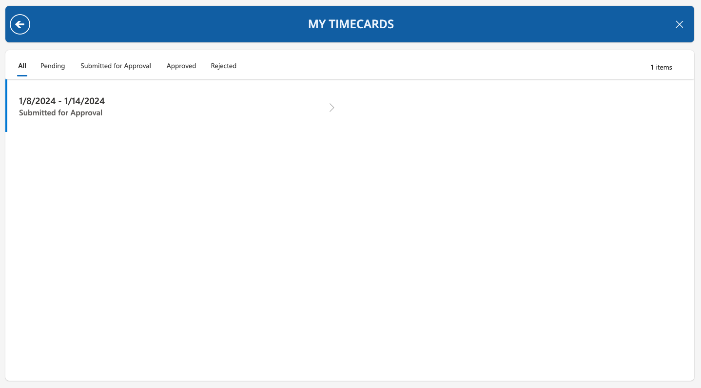
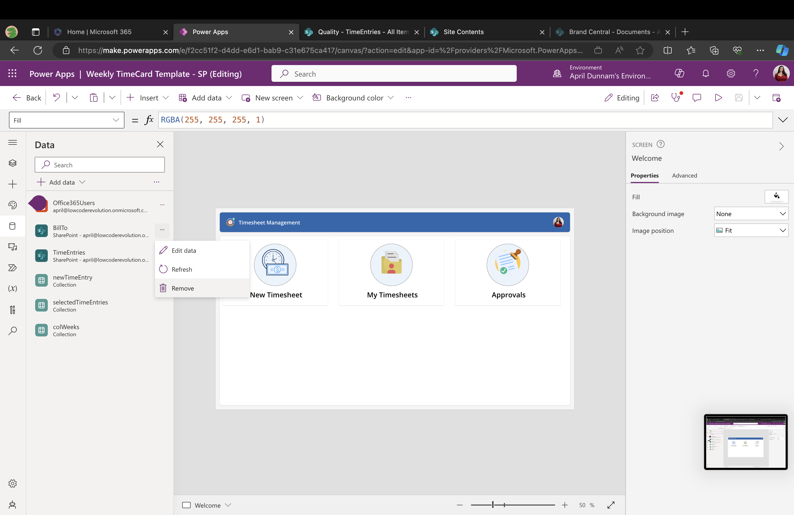
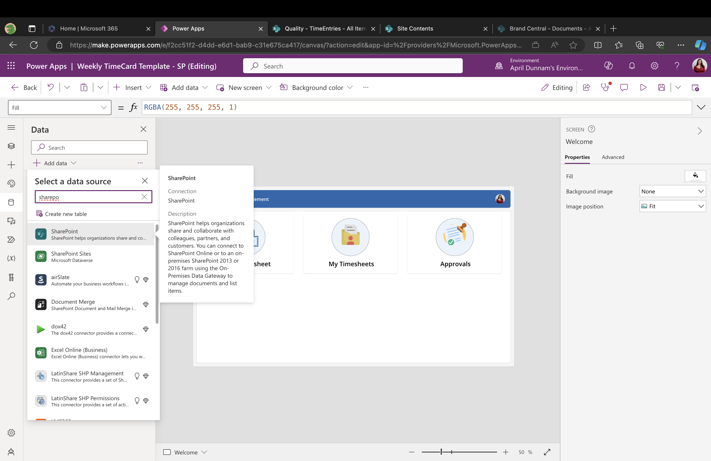
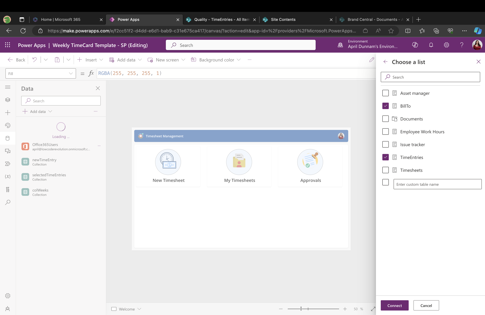

# Power Apps Weekly Timesheet Template

## Summary

This sample shows how to implement a weekly timesheet application using Power Apps (canvas app).

## Applies to

## Compatibility

## Contributors

- [April Dunnam](https://github.com/aprildunnam)

## Version history

Version|Date|Comments
-------|----|--------
1.0|January 08, 2024 |Initial release

## Features

This sample illustrates how to implement a weekly timesheet application using Power Apps.  The solution consists of a canvas app and utilizes modern controls, named formulas and containers. 

### Key Features of the solution include:
* The ability to submit time cards in a weekly view

* View all submitted time cards and their status as an employee

* Have a manager view to see your team's time cards and approve
* The sample uses SharePoint as the back end so no additional license is required but can be easily adapted to use Dataverse

## Data Sources

* SharePoint

## Step 1: Setup the lists
The first list is **BillTo**, which is a reference list to store what to assign the time to.  This is customizable to whatever you want to assign the time to. For example, this can be to a particular customer, a project, or to a type of time (overtime, regular, etc). 

| **List Column** | **Data Type** | **Notes** |
| --- | --- | --- |
| Title |Single line of text |Default column, used for BillTo name |

The second list is **TimeEntries** which is the main list that stores all of the timesheet data.

| **List Column** | **Data Type** | **Notes** |
| --- | --- | --- |
| Title |Single line of text |Default column, used for project name |
| Comments |Multiple lines of text | |
| ManagerComments |Multiple lines of text | |
| EmployeeTxt |Single lines of text | |
| Status |Choice |Values: Pending, Submitted for Approval, Approved, Rejected |
| WeekStart |Date | |
| Employee |Person or Group | |
| Manager |Person or Group | |
| Mon |Number | |
| Tues |Number | |
| Weds |Number | |
| Thurs |Number | |
| Fri |Number | |
| Sat |Number | |
| Sun |Number | |
| Total |Number | |
| BillTo |Lookup | BillTo List, Title Column|

## Installation

* [Download](./solution/weekly-timesheet-sharepoint.zip) the `.zip` from the `solution` folder
* Within **Power Apps Studio**, import the solution `.zip` file using **Solutions** > **Import Solution** and select the `.zip` file you just packed.
* Open the Timesheet Template app in Edit mode
* Go to the datasources tab and remove the BillTo and TimeEntries tables

* In the datasources tab, click add new and search for SharePoint

* Navigate to where you created the lists and add the TimeEntries and BillTo list to your app

* Save and Publish

## Help

We do not support samples, but this community is always willing to help, and we want to improve these samples. We use GitHub to track issues, which makes it easy for  community members to volunteer their time and help resolve issues.

If you encounter any issues while using this sample, you can [create a new issue](https://github.com/pnp/powerplatform-samples/issues/new?assignees=&labels=Needs%3A+Triage+%3Amag%3A%2Ctype%3Abug-suspected&template=bug-report.yml&sample=weekly-timesheet-sharepoint&authors=@aprildunnam&title=weekly-timesheet-sharepoint%20-%20).

For questions regarding this sample, [create a new question](https://github.com/pnp/powerplatform-samples/issues/new?assignees=&labels=Needs%3A+Triage+%3Amag%3A%2Ctype%3Abug-suspected&template=question.yml&sample=weekly-timesheet-sharepoint&authors=@aprildunnam&title=weekly-timesheet-sharepoint%20-%20).

Finally, if you have an idea for improvement, [make a suggestion](https://github.com/pnp/powerplatform-samples/issues/new?assignees=&labels=Needs%3A+Triage+%3Amag%3A%2Ctype%3Abug-suspected&template=suggestion.yml&sample=weekly-timesheet-sharepoint&authors=@aprildunnam&title=weekly-timesheet-sharepoint%20-%20).

## Disclaimer

**THIS CODE IS PROVIDED *AS IS* WITHOUT WARRANTY OF ANY KIND, EITHER EXPRESS OR IMPLIED, INCLUDING ANY IMPLIED WARRANTIES OF FITNESS FOR A PARTICULAR PURPOSE, MERCHANTABILITY, OR NON-INFRINGEMENT.**

## For more information

* [Overview of creating apps in Power Apps](https://docs.microsoft.com/powerapps/maker/)
* [Power Apps canvas apps documentation](https://docs.microsoft.com/powerapps/maker/canvas-apps/)

---
